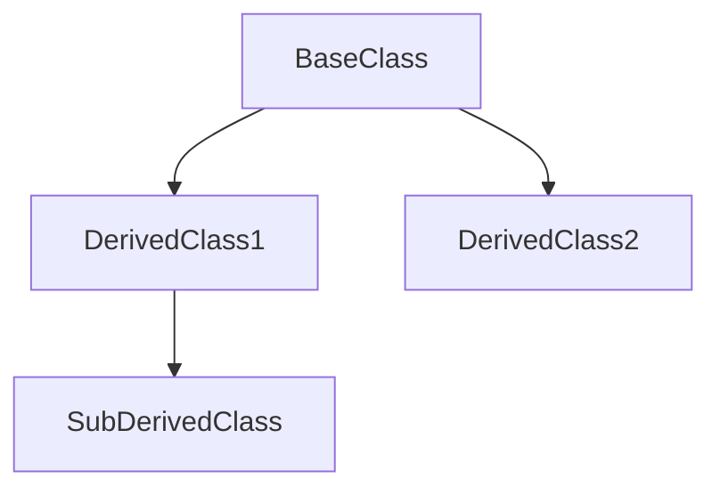

# OOP Inheritance in C#

Inheritance is a cornerstone of Object-Oriented Programming (OOP) in C#, enabling a class (called the **derived class** or **child class**) to inherit fields, methods, and properties from another class (called the **base class** or **parent class**). This mechanism supports code reuse, modularity, and scalability, allowing developers to efficiently build maintainable and robust systems.

---

## Core Concepts

### 1. **Base Class**
A **base class** serves as the foundation from which other classes derive functionality. It encapsulates shared attributes and behaviors that multiple derived classes can reuse.

#### Features of a Base Class:
- **Fields**: Shared variables.
- **Properties**: Encapsulation of fields using `get` and `set`.
- **Methods**: Common functionality shared with derived classes.
- **Constructors**: Used for initialization.

#### Example:
```csharp
public class BaseClass
{
    public string Name;

    public void Display()
    {
        Console.WriteLine($"Name: {Name}");
    }
}
```

### 2. **Derived Class**
A **derived class** extends the base class and inherits its members, with the flexibility to:
- Use inherited members directly.
- Add unique functionality.
- Override methods for specialized behavior.

#### Example:
```csharp
public class DerivedClass : BaseClass
{
    public int Age;

    public void ShowDetails()
    {
        Display(); // Using inherited method
        Console.WriteLine($"Age: {Age}");
    }
}
```

---

## Access Modifiers
Access modifiers control the visibility of members between the base and derived classes:

| Modifier           | Base Class Accessible | Derived Class Accessible | Other Classes Accessible |
|--------------------|------------------------|---------------------------|--------------------------|
| **public**         | Yes                    | Yes                       | Yes                      |
| **protected**      | Yes                    | Yes                       | No                       |
| **private**        | Yes                    | No                        | No                       |
| **internal**       | Yes                    | Yes (within assembly)     | Yes (within assembly)    |
| **protected internal** | Yes                | Yes                       | No (outside assembly)    |

#### Example:
```csharp
public class BaseClass
{
    public string PublicField = "Public";
    protected string ProtectedField = "Protected";
    private string PrivateField = "Private";
}

public class DerivedClass : BaseClass
{
    public void ShowFields()
    {
        Console.WriteLine(PublicField);     // Accessible
        Console.WriteLine(ProtectedField); // Accessible
        // Console.WriteLine(PrivateField); // Not accessible
    }
}
```

---

## Key Features of Inheritance

### 1. **Using `base` Keyword**
The `base` keyword allows derived classes to:
- Call base class constructors.
- Access base class members explicitly.

#### Example:
```csharp
public class BaseClass
{
    public BaseClass()
    {
        Console.WriteLine("Base Constructor");
    }

    public void Greet()
    {
        Console.WriteLine("Hello from Base Class");
    }
}

public class DerivedClass : BaseClass
{
    public DerivedClass() : base()
    {
        Console.WriteLine("Derived Constructor");
    }

    public void CallBaseGreet()
    {
        base.Greet();
    }
}

// Output:
// Base Constructor
// Derived Constructor
```

### 2. **Method Overriding**
Derived classes can redefine base class behavior using the `override` keyword. Base class methods must be marked as `virtual` or `abstract`.

#### Example:
```csharp
public class BaseClass
{
    public virtual void Greet()
    {
        Console.WriteLine("Hello from Base Class");
    }
}

public class DerivedClass : BaseClass
{
    public override void Greet()
    {
        Console.WriteLine("Hello from Derived Class");
    }
}

// Output: Hello from Derived Class
```

### 3. **Abstract Classes and Methods**
Abstract classes cannot be instantiated and act as blueprints. They may contain abstract methods (without implementation) and regular methods.

#### Example:
```csharp
public abstract class Animal
{
    public abstract void Speak();
    public void Eat()
    {
        Console.WriteLine("Eating...");
    }
}

public class Dog : Animal
{
    public override void Speak()
    {
        Console.WriteLine("Bark");
    }
}

// Output: Bark
```

### 4. **Sealing Classes and Methods**
Sealed classes cannot be inherited, and sealed methods cannot be overridden further.

#### Example:
```csharp
public class BaseClass
{
    public virtual void Greet()
    {
        Console.WriteLine("Hello from Base Class");
    }
}

public class DerivedClass : BaseClass
{
    public sealed override void Greet()
    {
        Console.WriteLine("Hello from Derived Class");
    }
}

// Further overriding of Greet is not allowed.
```

---

## Visualizing Inheritance with Flow
To understand inheritance hierarchies better, we use a flowchart to represent class relationships:



This flowchart depicts:
- `BaseClass` as the parent class.
- `DerivedClass1` and `DerivedClass2` inheriting from `BaseClass`.
- `SubDerivedClass` inheriting from `DerivedClass1`.

---

## Benefits of Inheritance

1. **Code Reusability**: Common logic resides in the base class, reducing redundancy.
2. **Extensibility**: Derived classes can build upon existing functionality.
3. **Polymorphism**: Enables runtime method overriding and dynamic behavior.
4. **Hierarchical Structuring**: Models real-world relationships (e.g., `Vehicle` -> `Car`, `Bike`).

---

## Limitations of Inheritance

1. **Tight Coupling**: Changes to the base class can affect derived classes.
2. **Complexity**: Deep inheritance hierarchies are harder to manage.
3. **Overriding Pitfalls**: Misuse of overriding can cause unexpected behavior.

---

## Best Practices

1. **Use When Appropriate**: Ensure there is a natural **is-a** relationship.
2. **Favor Composition Over Inheritance**: For shared behavior, prefer composition.
3. **Avoid Deep Hierarchies**: Keep inheritance levels shallow to simplify maintenance.
4. **Clearly Document Base Classes**: Indicate intended use for members and methods.

---

## Conclusion

Inheritance in C# is a versatile feature for building robust object-oriented applications. By mastering its nuances and adhering to best practices, developers can create scalable and maintainable systems that are both efficient and flexible.
