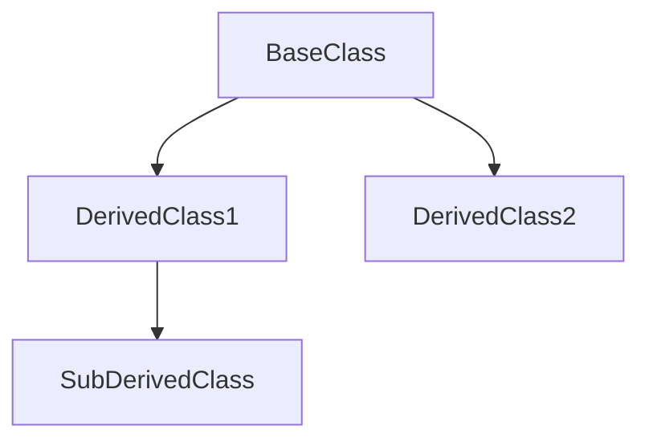

# OOP Inheritance in C#

Inheritance is a cornerstone of Object-Oriented Programming (OOP) in C#, enabling a class (called the **derived class** or **child class**) to inherit fields, methods, and properties from another class (called the **base class** or **parent class**). This mechanism supports code reuse, modularity, and scalability, allowing developers to efficiently build maintainable and robust systems.

---

## Table of Contents

1. [Introduction to Inheritance](#introduction-to-inheritance)
2. [Basic Concepts](#basic-concepts)
3. [Access Modifiers in Inheritance](#access-modifiers-in-inheritance)
4. [Advanced Features of Inheritance](#advanced-features-of-inheritance)
5. [Polymorphism and Dynamic Binding](#polymorphism-and-dynamic-binding)
6. [Visualizing Inheritance](#visualizing-inheritance)
7. [Limitations and Challenges](#limitations-and-challenges)
8. [Best Practices for Using Inheritance](#best-practices-for-using-inheritance)
9. [Practical Examples](#practical-examples)
10. [Comparison with Other OOP Principles](#comparison-with-other-oop-principles)
11. [Conclusion and Summary](#conclusion-and-summary)

---

## 1. Introduction to Inheritance
- **Definition and Purpose**: Understanding what inheritance is and why it is used.
- **Benefits**: Overview of how inheritance promotes code reuse, modularity, and scalability.
- **Real-World Analogies**: Relating inheritance to real-life examples, such as a family tree or organizational structure.

---

## 2. Basic Concepts
- **Base Class and Derived Class**: Explanation of the roles of parent and child classes in inheritance.
- **Inheritance Syntax**: A look at how inheritance is implemented in C# using the `:` symbol.
- **How Inheritance Works**: Step-by-step overview of the inheritance process and what gets inherited.

---

## 3. Access Modifiers in Inheritance
- **Access Control**: How access modifiers (`public`, `protected`, `private`, etc.) affect visibility.
- **Visibility Rules**: Explaining which members are inherited and accessible in derived classes.
- **Comparison Table**: Summarizing the differences in access levels.

---

## 4. Advanced Features of Inheritance
- **Overriding Methods**: Using `virtual` and `override` to redefine base class behavior.
- **The `base` Keyword**: Calling base class constructors or methods explicitly.
- **Abstract Classes and Methods**: Creating blueprints for derived classes using abstract members.
- **Sealed Classes and Methods**: Restricting further inheritance or overriding with the `sealed` keyword.

---

## 5. Polymorphism and Dynamic Binding
- **Method Overriding vs Method Overloading**: Differentiating between compile-time and runtime behavior.
- **Runtime Polymorphism**: How a base class reference can point to derived class objects.
- **Examples**: Practical scenarios where polymorphism enhances code flexibility.

---

## 6. Visualizing Inheritance
- **Hierarchical Class Diagrams**: Representing inheritance structures graphically.
- **UML and Mermaid Diagrams**: Using tools to visualize class relationships and hierarchies.

#### Example Mermaid Diagram:

---

## 7. Limitations and Challenges
- **Tight Coupling**: How changes in the base class can cascade to derived classes.
- **Deep Hierarchies**: The difficulties of managing complex inheritance trees.
- **Overriding Issues**: Potential pitfalls of improper method overriding.

---

## 8. Best Practices for Using Inheritance
- **Judicious Use**: When to use inheritance and when to avoid it.
- **Favor Composition**: Using composition as an alternative to inheritance where appropriate.
- **Shallow Hierarchies**: Keeping inheritance structures simple and manageable.
- **Documenting Base Classes**: Clearly defining the purpose and usage of base members.

---

## 9. Practical Examples
- **Simple Inheritance Example**: Demonstrating inheritance with a straightforward parent-child relationship.
- **Multi-Level Inheritance**: Showing how inheritance can span multiple levels.
- **Real-World Applications**: Examples such as `Vehicle` hierarchies (`Car`, `Truck`, etc.) or shapes (`Circle`, `Square`).

---

## 10. Comparison with Other OOP Principles
- **Inheritance vs Composition**: Highlighting when to use one over the other.
- **Interaction with Encapsulation and Abstraction**: Understanding how inheritance complements these principles.

---

## 11. Conclusion and Summary
- **Key Takeaways**: Summarizing the benefits and considerations of inheritance.
- **Effective Application**: How to use inheritance judiciously to build maintainable and scalable systems.

---
