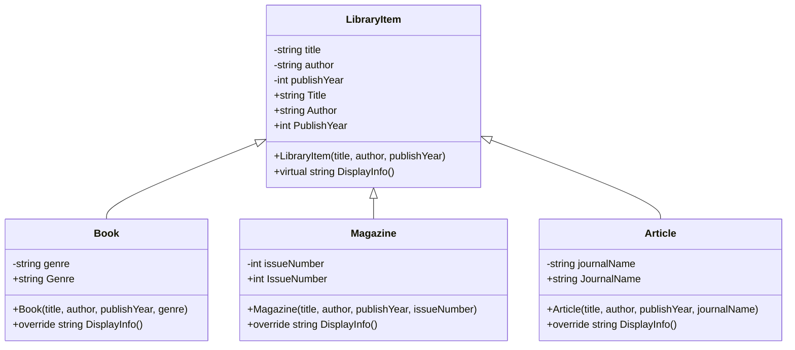
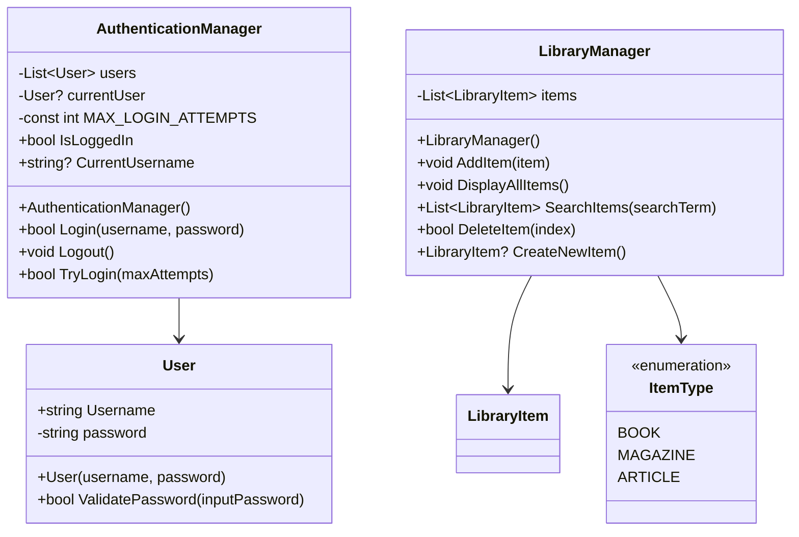
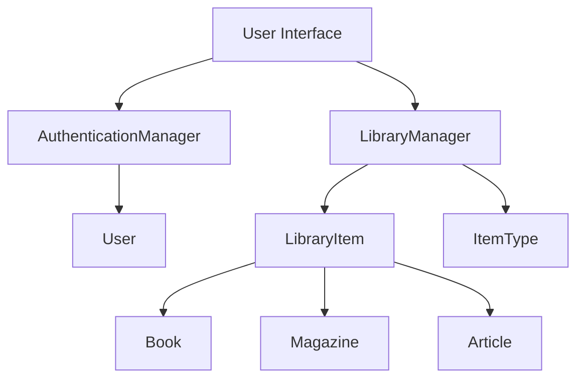
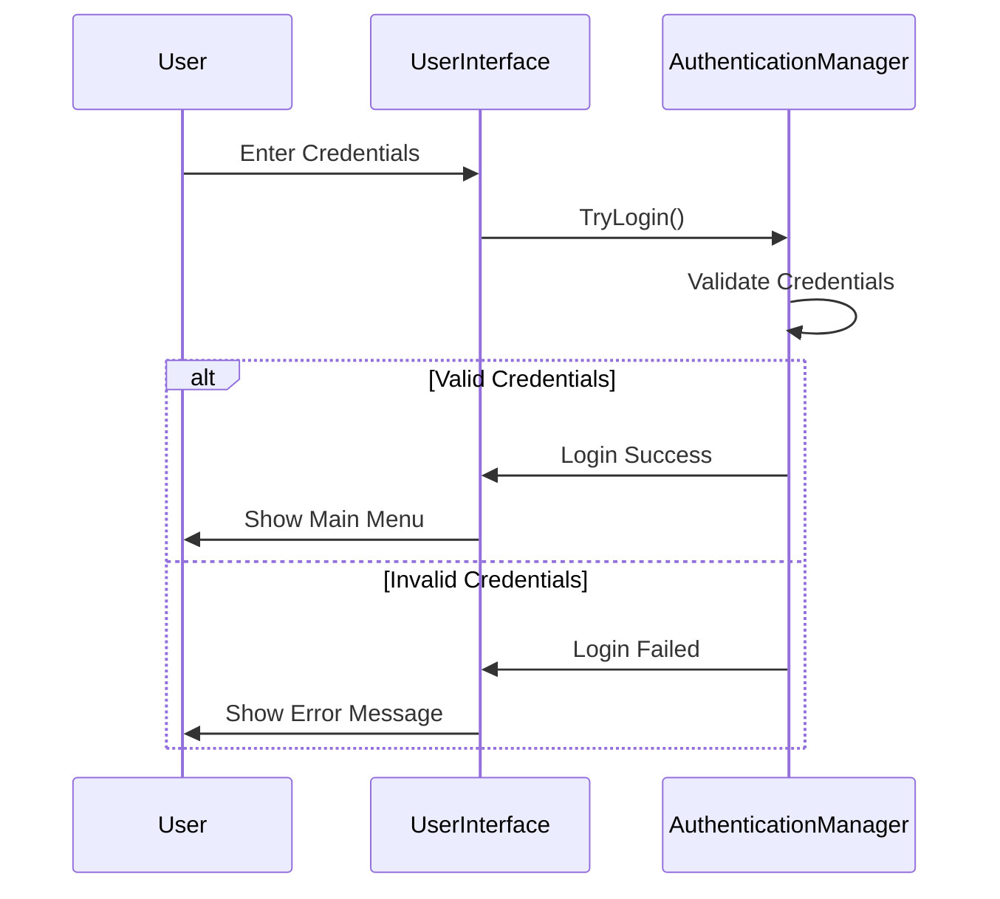

### **Project Documentation: User-Input-Based Library Management System**

This document is designed to help students acquire the skills necessary for real-world software development by simulating a scenario where they create a library management system for an academic institution or community library. This system will enable users to log in, manage library items, and understand the principles of Object-Oriented Programming (OOP) in a practical context. The project encompasses user authentication, library item management, and the application of **Object-Oriented Programming (OOP)** principles. The key areas of focus include:

- **Encapsulation**
- **Inheritance**
- **Access Modifiers**
- **User Sessions and Authentication**
- **Enum Usage**
- **Modular and Clean Code Development**

---

## **Project Objective**
The goal of this project is to enable users to log into a library system and manage items such as books, magazines, and articles. This system is particularly designed for academic institutions or community libraries, where efficient management of resources is essential. The user authentication system ensures that only authorized users can perform operations within the library. Additional objectives include:

- Enhancing code modularity.
- Developing an understanding of realistic project structures.
- Demonstrating the practical relationship between encapsulation and inheritance.

---

## **Project Steps**

### **Step 1: Requirement Analysis**
**Why?**  
To define the project scope and user requirements, gather inputs through discussions with stakeholders, such as librarians or administrators, to understand their needs. Validate these requirements by mapping them to system functionalities and ensuring alignment with the project's objectives.

**What to Do?**
1. User authentication system:
   - Validate username and password.
   - Start a session upon successful login.
   - Prompt retries for incorrect login attempts.
2. Library management system:
   - Users can add, list, search, and delete items.

**Deliverable:**
- A document defining requirements and system functionality.

---

### **Step 2: Project Structure Design**
**Why?**  
To plan a modular and scalable design with appropriate classes and methods.

**What to Do?**
1. **User Class**:
   - Stores username and password.
2. **AuthenticationManager**:
   - Handles user session operations and login validation.
3. **LibraryItem (Base Class)**:
   - Common attributes: Title, Author, Publish Year.
   - Use `protected` and `private` access modifiers for encapsulation.
4. **Derived Classes**:
   - `Book`, `Magazine`, and `Article` classes define unique properties.
5. **LibraryManager**:
   - Manages library operations such as adding, listing, searching, and deleting items.

**UML Class Diagrams**





**System Architecture Diagram**


**Sequence Diagram: Login Process**


---

### **Step 3: User Authentication (AuthenticationManager)**
**Why?**  
To secure the system and authorize user actions.

**What to Do?**
1. Validate username and password.
2. Check login session status.
3. Allow retry attempts for incorrect credentials.

**Deliverable:**
- A module implementing user authentication.

---

### **Step 4: Base Library Class (LibraryItem)**
**Why?**  
To define shared attributes and behaviors for all library items.

**What to Do?**
1. Define attributes such as `Title`, `Author`, and `PublishYear`.
2. Use `private` and `protected` modifiers for encapsulation.
3. Add a `DisplayInfo` method for printing item details.

**Deliverable:**
- A base class for library items.

---

### **Step 5: Add Derived Classes**
**Why?**  
To manage unique attributes of different item types.

**What to Do?**
1. **Book**:
   - Additional attribute: Genre.
2. **Magazine**:
   - Additional attribute: Issue Number.
3. **Article**:
   - Additional attribute: Journal Name.
4. All derived classes inherit from `LibraryItem`.
5. Override the `DisplayInfo` method in each class.

**Deliverable:**
- Modules for books, magazines, and articles.

---

### **Step 6: Manage Item Types with Enums**
**Why?**  
To simplify and standardize item type management.

**What to Do?**
1. Create an enum `ItemType`:
   - Types: Book, Magazine, Article.

For example, the enum can be implemented as follows:
```java
public enum ItemType {
    BOOK,
    MAGAZINE,
    ARTICLE;
}
```
This enum can then be used to specify the type of each library item in the system.
2. Use the enum for item type selection.
3. Improve code readability and maintainability.

**Deliverable:**
- An enum for managing item types.

---

### **Step 7: LibraryManager Class**
**Why?**  
To centralize all library operations.

**What to Do?**
1. `AddNewItem`: Gathers item details and adds them to the library.
2. `DisplayAllItems`: Lists all library items.
3. `SearchItem`: Searches items by title.
4. `DeleteItem`: Removes a specific item from the library.

**Deliverable:**
- A class managing library operations.

---

### **Step 8: Menu and User Interaction**
**Why?**  
To create a user-friendly interface for interacting with the system.

**What to Do?**
1. Design a main menu:
   - Option 1: Add new item.
   - Option 2: List items.
   - Option 3: Search items.
   - Option 4: Delete an item.
   - Option 5: Exit.
2. Ensure valid user input.
3. Prompt for retries on invalid input.

**Deliverable:**
- A user-friendly menu system.

---

## **Deliverables**
1. **AuthenticationManager**:
   - User authentication module.
2. **LibraryItem and Derived Classes**:
   - Base and specialized library item classes.
3. **LibraryManager**:
   - Class managing library operations.
4. **Enum (ItemType)**:
   - Enum for item type management.
5. **User-Friendly Menu**:
   - Interface for user interaction.

---

## **Recommendations and Improvements**
1. **Focus on Encapsulation**:  
   - Use `private` fields and control access with `get` and `set` methods.
2. **Leverage Inheritance**:  
   - Move common attributes to the base class to reduce redundancy.
3. **Write Simple Code**:  
   - Break operations into small, manageable methods.
   - Avoid long, complex code blocks for readability.
4. **Error Handling**:  
   - Provide clear feedback for invalid inputs or actions. For instance, handle errors such as invalid input formats by prompting the user with an example of correct input. Address network issues by retrying the operation or informing the user of the connection problem. Ensure detailed and user-friendly messages are displayed for each type of error to improve the overall experience.

---

## **Technical Details**

### **Data Structures Used**
1. **Arrays**
   ```csharp
   // Fixed-size arrays with maximum capacity
   private LibraryItem[] items;
   private User[] users;
   private int itemCount;  // Track current number of items
   private int userCount;  // Track current number of users
   
   // Initialize arrays in constructor
   public LibraryManager() {
       items = new LibraryItem[100];  // Maximum 100 items
       itemCount = 0;
   }
   ```

2. **Array Operations Example**
   ```csharp
   // Adding an item
   public bool AddItem(LibraryItem item) {
       if (itemCount >= items.Length) {
           Console.WriteLine("Library is full!");
           return false;
       }
       items[itemCount] = item;
       itemCount++;
       return true;
   }

   // Removing an item
   public bool DeleteItem(int index) {
       if (index < 0 || index >= itemCount) {
           return false;
       }
       // Shift remaining elements left
       for (int i = index; i < itemCount - 1; i++) {
           items[i] = items[i + 1];
       }
       items[itemCount - 1] = null;
       itemCount--;
       return true;
   }

   // Searching items
   public LibraryItem[] SearchItems(string searchTerm) {
       int matchCount = 0;
       // First count matches
       for (int i = 0; i < itemCount; i++) {
           if (items[i].Title.Contains(searchTerm) || 
               items[i].Author.Contains(searchTerm)) {
               matchCount++;
           }
       }
       
       // Create result array
       LibraryItem[] results = new LibraryItem[matchCount];
       int resultIndex = 0;
       
       // Fill result array
       for (int i = 0; i < itemCount; i++) {
           if (items[i].Title.Contains(searchTerm) || 
               items[i].Author.Contains(searchTerm)) {
               results[resultIndex++] = items[i];
           }
       }
       return results;
   }
   ```

3. **Array Size Constants**
   ```csharp
   public class LibraryManager {
       private const int MAX_ITEMS = 100;
       private const int MAX_USERS = 50;
       private LibraryItem[] items;
       private int itemCount;
   }
   ```

### **Design Patterns with Arrays**
1. **Array-based Repository Pattern**
   ```csharp
   public class UserRepository {
       private User[] users;
       private int userCount;
       private const int MAX_USERS = 50;

       public UserRepository() {
           users = new User[MAX_USERS];
           userCount = 0;
       }

       public bool Add(User user) {
           if (userCount >= MAX_USERS) return false;
           users[userCount++] = user;
           return true;
       }

       public User FindByUsername(string username) {
           for (int i = 0; i < userCount; i++) {
               if (users[i].Username == username) {
                   return users[i];
               }
           }
           return null;
       }
   }
   ```

2. **Array Utility Methods**
   ```csharp
   public static class ArrayHelper {
       public static void ShiftLeft<T>(T[] array, int startIndex, int count) {
           for (int i = startIndex; i < count - 1; i++) {
               array[i] = array[i + 1];
           }
           array[count - 1] = default(T);
       }

       public static bool IsFull<T>(T[] array, int currentCount) {
           return currentCount >= array.Length;
       }
   }
   ```

### **Performance Considerations**
1. **Array Operations Time Complexity**
   - Adding at end: O(1)
   - Deleting with shift: O(n)
   - Searching: O(n)
   - Random access: O(1)

2. **Memory Usage**
   - Fixed memory allocation
   - No dynamic resizing
   - Memory efficient for fixed-size collections

3. **Limitations**
   - Fixed size (need to specify maximum capacity)
   - Shifting elements on deletion
   - No built-in dynamic resizing

### **Error Handling with Arrays**
```csharp
public class LibraryManager {
    public bool AddItem(LibraryItem item) {
        try {
            if (item == null) {
                Console.WriteLine("Error: Cannot add null item");
                return false;
            }
            
            if (itemCount >= items.Length) {
                Console.WriteLine("Error: Library is full");
                return false;
            }
            
            items[itemCount++] = item;
            Console.WriteLine("Item added successfully");
            return true;
        }
        catch (Exception ex) {
            Console.WriteLine($"Error adding item: {ex.Message}");
            return false;
        }
    }
}
```

### **Design Patterns**
1. **Inheritance Hierarchy**
   - Base class: `LibraryItem`
   - Derived classes: `Book`, `Magazine`, `Article`

2. **Encapsulation Example**
   ```csharp
   private string title;
   public string Title
   {
       get { return title; }
       protected set { title = value; }
   }
   ```

3. **Factory Method Pattern**
   - `CreateNewItem()` in LibraryManager implements a simple factory pattern

### **Code Organization**
```
LibraryManagementSystem/
├── Models/
│   ├── LibraryItem.cs
│   ├── Book.cs
│   ├── Magazine.cs
│   ├── Article.cs
│   └── User.cs
├── Managers/
│   ├── AuthenticationManager.cs
│   └── LibraryManager.cs
├── Enums/
│   └── ItemType.cs
└── Program.cs
```

### **Detailed Folder Structure**
```
LibraryManagementSystem/
├── Models/                  # Contains all data models
│   ├── LibraryItem.cs      # Base abstract class for all library items
│   ├── Book.cs             # Book class inheriting from LibraryItem
│   ├── Magazine.cs         # Magazine class inheriting from LibraryItem
│   ├── Article.cs          # Article class inheriting from LibraryItem
│   └── User.cs             # User model for authentication
│
├── Managers/               # Contains manager classes
│   ├── AuthenticationManager.cs  # Handles user authentication
│   └── LibraryManager.cs         # Manages library operations
│
├── Enums/                  # Contains enum definitions
│   └── ItemType.cs         # Enum for different types of library items
│
├── Helpers/                # Contains utility classes
│   └── ArrayHelper.cs      # Helper methods for array operations
│
├── Constants/              # Contains constant definitions
│   └── SystemConstants.cs  # System-wide constant values
│
├── Program.cs              # Main entry point
└── README.md              # Project documentation

```

### **File Purposes**

1. **Models Folder**
   - `LibraryItem.cs`: Abstract base class defining common properties and methods
     ```csharp
     public abstract class LibraryItem
     {
         protected string title;
         protected string author;
         protected int publishYear;
         // ... methods and properties
     }
     ```
   - `Book.cs`, `Magazine.cs`, `Article.cs`: Derived classes with specific properties
   - `User.cs`: User data model for authentication

2. **Managers Folder**
   - `AuthenticationManager.cs`: Handles all user authentication operations
     ```csharp
     public class AuthenticationManager
     {
         private User[] users;
         private int userCount;
         // ... authentication methods
     }
     ```
   - `LibraryManager.cs`: Manages library item operations

3. **Enums Folder**
   - `ItemType.cs`: Defines the types of library items
     ```csharp
     public enum ItemType
     {
         BOOK,
         MAGAZINE,
         ARTICLE
     }
     ```

4. **Helpers Folder**
   - `ArrayHelper.cs`: Contains utility methods for array operations
     ```csharp
     public static class ArrayHelper
     {
         public static void ShiftLeft<T>(T[] array, int startIndex, int count)
         {
             // ... implementation
         }
     }
     ```

5. **Constants Folder**
   - `SystemConstants.cs`: System-wide constants
     ```csharp
     public static class SystemConstants
     {
         public const int MAX_ITEMS = 100;
         public const int MAX_USERS = 50;
         public const int MAX_LOGIN_ATTEMPTS = 3;
     }
     ```

### **File Organization Best Practices**

1. **Naming Conventions**
   - Use PascalCase for class files: `LibraryItem.cs`
   - Use PascalCase for folders: `Models/`
   - Group related files in appropriate folders

2. **File Content Guidelines**
   - One class per file
   - File name matches class name
   - Keep files focused and single-purpose
   - Use regions for large files if needed

3. **Folder Organization Rules**
   - Group related files together
   - Keep flat hierarchy where possible
   - Use meaningful folder names
   - Maintain consistent structure

4. **Project Structure Benefits**
   - Easy navigation
   - Clear organization
   - Maintainable codebase
   - Scalable structure
   - Clear dependencies

---

This documentation serves as a step-by-step guide for planning, developing, and extending the project. It emphasizes key software principles such as **encapsulation**, **inheritance**, and **user authentication**, providing a comprehensive learning experience for students. 😊

