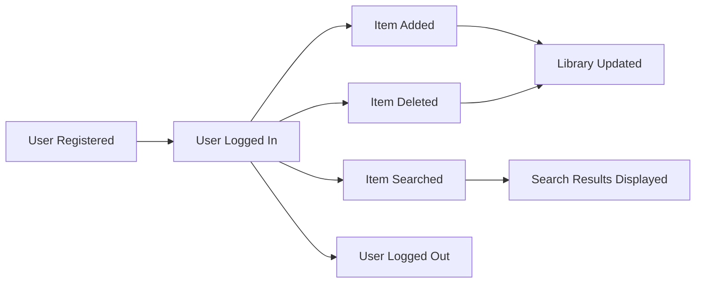
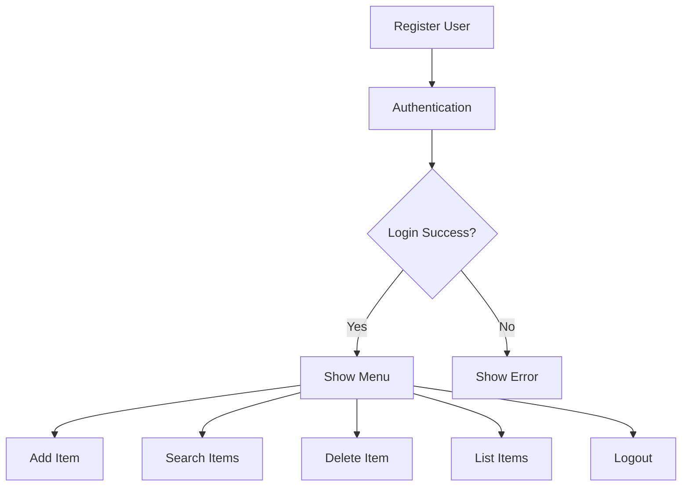
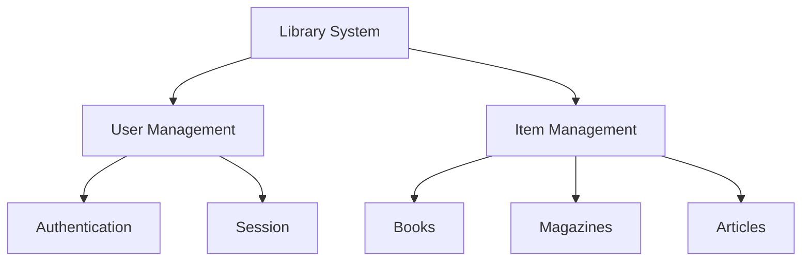
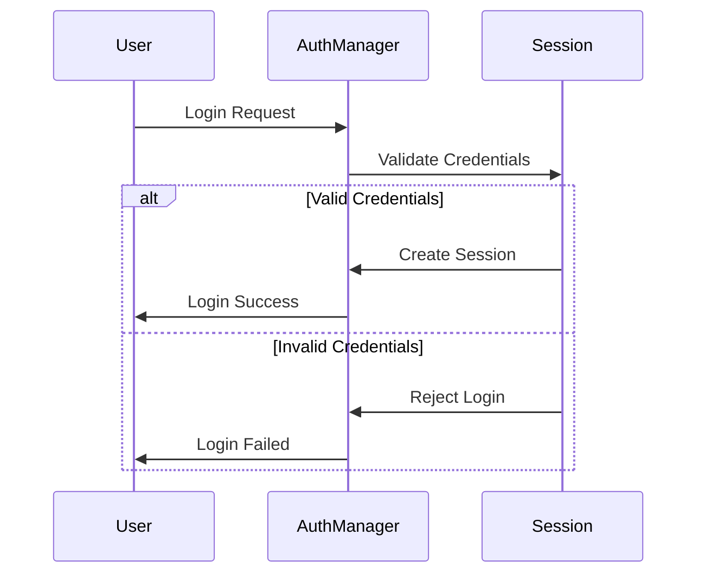
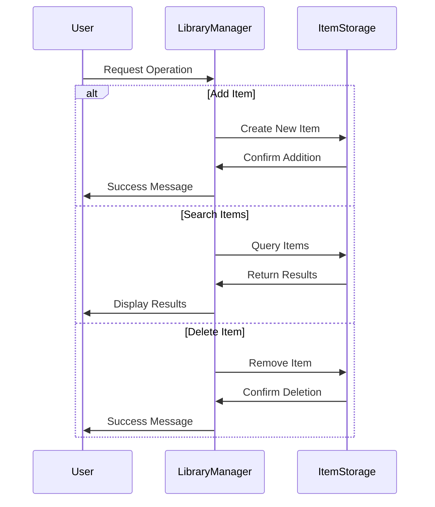
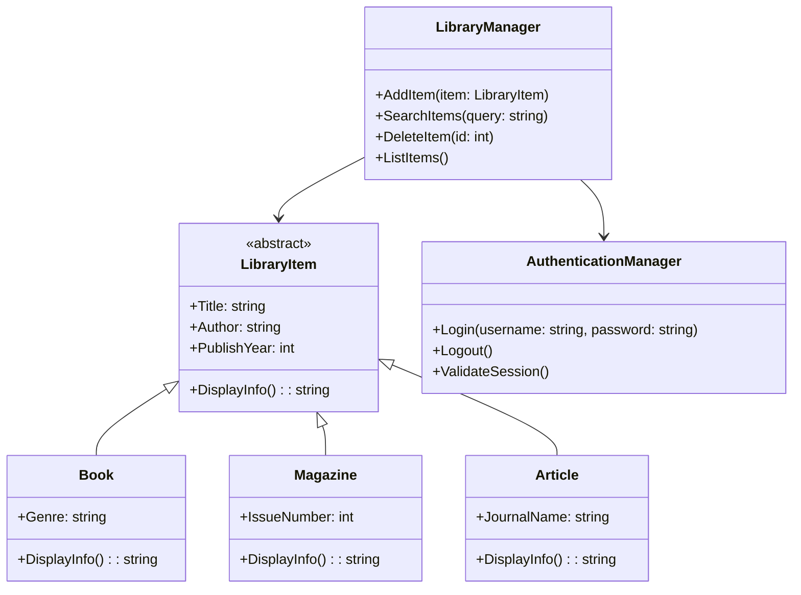
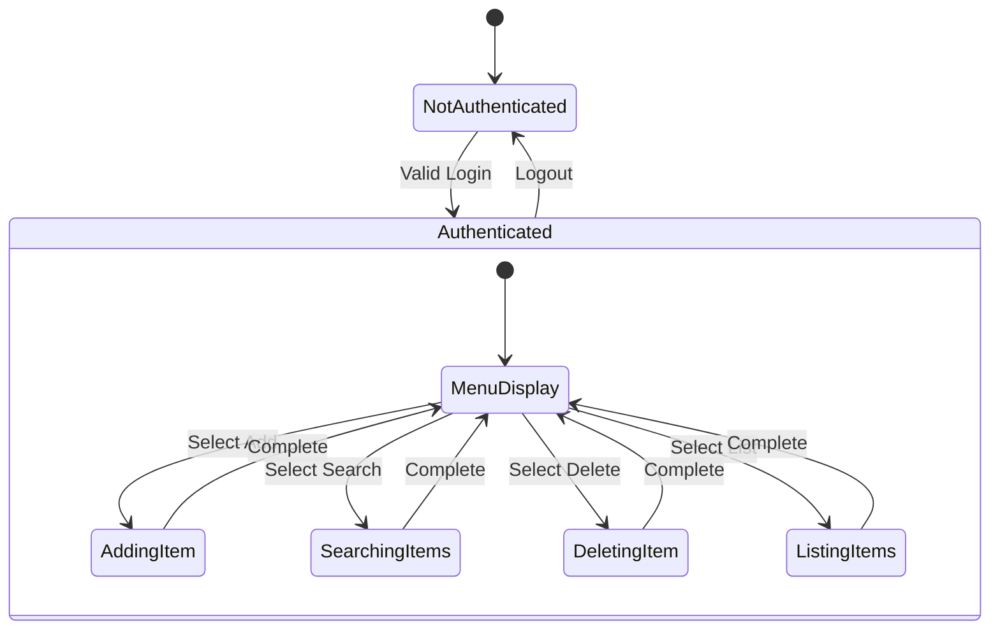

# Library Management System (.NET 6.0)

## Project Overview
A modern console-based Library Management System built with .NET 6.0, demonstrating Object-Oriented Programming principles and clean architecture. This system enables users to manage library resources efficiently through a user-friendly command-line interface.

## Event Storming Analysis

### Domain Events


### Commands


### Aggregate Roots


## System Flow Diagrams

### Authentication Flow


### Library Operations Flow


### Class Relationships


### State Machine


## Technical Specifications
- **Framework**: .NET 6.0
- **Language**: C# 10.0
- **Project Type**: Console Application
- **Nullable**: Enabled
- **Implicit Usings**: Enabled

## Project Structure
```
LibraryManagementSystem/
├── Models/                  # Data models
│   ├── LibraryItem.cs      # Base abstract class
│   ├── Book.cs             # Book implementation
│   ├── Magazine.cs         # Magazine implementation
│   ├── Article.cs          # Article implementation
│   └── User.cs             # User model
├── Managers/               # Business logic
│   ├── AuthenticationManager.cs
│   └── LibraryManager.cs
├── Constants/              # System constants
│   └── SystemConstants.cs
├── Enums/                  # Enumerations
│   └── ItemType.cs
├── Program.cs             # Entry point
└── README.md              # Documentation
```

## Features
1. **User Authentication**
   - Secure login system
   - Session management
   - Maximum login attempts

2. **Library Item Management**
   - Add new items (Books, Magazines, Articles)
   - List all items
   - Search functionality
   - Delete items

3. **Object-Oriented Design**
   - Inheritance hierarchy for library items
   - Encapsulation of data and behavior
   - Clean separation of concerns

## Class Structure

### Base Class: LibraryItem
```csharp
public abstract class LibraryItem
{
    protected string Title { get; set; }
    protected string Author { get; set; }
    protected int PublishYear { get; set; }
    
    public abstract string DisplayInfo();
}
```

### Derived Classes
- **Book**: Adds Genre property
- **Magazine**: Adds IssueNumber property
- **Article**: Adds JournalName property

### Manager Classes
- **AuthenticationManager**: Handles user authentication
- **LibraryManager**: Manages library operations

## Getting Started

### Prerequisites
- .NET 6.0 SDK or later
- Any text editor (VS Code recommended)
- Git (optional)

### Installation
1. Clone the repository:
   ```bash
   git clone [repository-url]
   ```

2. Navigate to project directory:
   ```bash
   cd LibraryManagementSystem
   ```

3. Build the project:
   ```bash
   dotnet build
   ```

4. Run the application:
   ```bash
   dotnet run
   ```

## Usage Examples

### 1. User Authentication
```csharp
var authManager = new AuthenticationManager();
bool isLoggedIn = authManager.Login("username", "password");
```

### 2. Adding a New Book
```csharp
var libraryManager = new LibraryManager();
var book = new Book("Title", "Author", 2024, "Fiction");
libraryManager.AddItem(book);
```

### 3. Searching Items
```csharp
var results = libraryManager.SearchItems("search term");
foreach (var item in results)
{
    Console.WriteLine(item.DisplayInfo());
}
```

## Project Goals
1. **Learning Objectives**
   - Understanding OOP principles
   - Working with inheritance hierarchies
   - Implementing clean architecture
   - Managing user authentication
   - Handling data persistence

2. **Best Practices**
   - Clean Code principles
   - SOLID principles
   - Proper error handling
   - Input validation
   - Code documentation

## Contributing
1. Fork the repository
2. Create your feature branch
3. Commit your changes
4. Push to the branch
5. Create a Pull Request

## Development Guidelines

### Coding Standards
- Use PascalCase for class names
- Use camelCase for variables
- Include XML documentation comments
- Follow C# coding conventions

### Testing
- Unit tests for core functionality
- Integration tests for managers
- User input validation tests

### Error Handling
```csharp
try
{
    // Operation code
}
catch (Exception ex)
{
    Console.WriteLine($"Error: {ex.Message}");
    // Appropriate error handling
}
```

## Future Enhancements
1. Database integration
2. User roles and permissions
3. Advanced search capabilities
4. Report generation
5. Web API implementation

## License
This project is licensed under the MIT License - see the LICENSE file for details.

## Acknowledgments
- .NET Team for the framework
- Contributors and reviewers
- Academic institution for project requirements

---

For more information about the learning topics and project tasks, see:
- [Learning Topics](docs/learning_topics.md)

