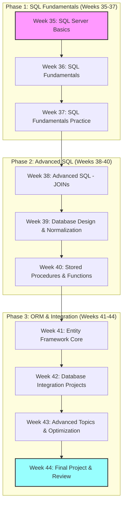

# Database Development Syllabus
**C# .NET Development Course - Database Track**

**Course Duration:** June 2025 - August 2025  
**Start Date:** 01.06.2025  
**End Date:** 09.08.2025  
**Format:** Integrated with C# Development  
**Language:** English  
**Instructor:** Parviz Rovshan Aliyev  
**Total Weeks:** 10 weeks  
**Total Hours:** 40 hours (4 hours per week)  

---

## Quick Navigation
[📚 Database Overview](#database-overview) | 
[🎯 Learning Objectives](#learning-objectives) | 
[🛠️ Database Tools](#database-tools) | 
[📖 Syllabus Contents](#syllabus-contents)

---

## Database Overview

This database track is designed to provide comprehensive knowledge of database development, from basic SQL concepts to advanced database management techniques. Students will learn to work with SQL Server, understand database design principles, and integrate databases with C# applications.

### What You'll Learn
- SQL Server fundamentals and management
- SQL query language (SELECT, INSERT, UPDATE, DELETE)
- Database design and normalization
- Advanced SQL concepts (JOINs, subqueries, stored procedures)
- Entity Framework and ORM concepts
- Database security and performance optimization
- Real-world database applications

### Career Opportunities
- Database Developer
- Database Administrator (DBA)
- Backend Developer with Database Focus
- Data Analyst
- Full-stack Developer with Database Expertise

### Learning Path

---

## Learning Objectives

### Phase 1: SQL Fundamentals (Weeks 35-37)
- **Week 35:** Introduction to SQL Server and basic database concepts
- **Week 36:** SQL Server Management Studio (SSMS) and basic SELECT queries
- **Week 37:** SQL fundamentals - SELECT, DISTINCT, WHERE, ORDER BY, logical operators

### Phase 2: Advanced SQL (Weeks 38-40)
- **Week 38:** JOIN operations and table relationships
- **Week 39:** Database design principles and normalization
- **Week 40:** Stored procedures and functions

### Phase 3: ORM & Integration (Weeks 41-44)
- **Week 41:** Entity Framework Core basics
- **Week 42:** Database integration with C# applications
- **Week 43:** Advanced database topics and optimization
- **Week 44:** Final project and course review

---

## Database Tools

### Required Software
- **Database Server:** SQL Server 2022 (Express or Developer Edition)
- **Management Tool:** SQL Server Management Studio (SSMS) 19.0+
- **IDE Integration:** Visual Studio 2022 with SQL Server tools
- **Additional Tools:**
  - Azure Data Studio (optional)
  - SQL Server Profiler (for performance analysis)
  - SQL Server Data Tools (SSDT)
  - Azure Data Studio (for cross-platform development)

### Sample Databases for Practice
- **AdventureWorks:** Microsoft's sample database for SQL Server
- **Northwind:** Classic sample database for learning
- **Pubs:** Simple database for basic concepts
- **Custom Databases:** Created during the course

### Development Environment Setup
1. Install SQL Server 2022
2. Install SQL Server Management Studio
3. Configure database connections
4. Set up sample databases for practice

---

## Syllabus Contents

### [Week 35: Introduction to SQL Server](#week-35)

**Date:** 01.06.2025  
**Topics:**
- Introduction to SQL Server and database concepts
- Installing SQL Server and SSMS
- Creating first database and tables
- Basic SELECT queries
- Understanding database structure

**Learning Materials:**
- [SQL Server Installation Guide](Week35/installation-guide.md)
- [Basic Database Concepts](Week35/database-concepts.md)
- [First Database Project](Week35/Database1/)

**Homework Assignment:**
- [Week35 Tasks - Database Basics](Week35/tasks.md)

---

### [Week 36: SQL Server Management Studio](#week-36)

**Date:** 09.06.2025  
**Topics:**
- SQL Server Management Studio interface
- Connecting to databases
- Writing and executing queries
- Understanding query results
- Basic database administration

**Learning Materials:**
- [SSMS Tutorial](Week36/ssms-tutorial.md)
- [Query Writing Basics](Week36/query-basics.md)
- [Database Administration Fundamentals](Week36/admin-basics.md)

**Homework Assignment:**
- [Week36 Tasks - SSMS Practice](Week36/tasks.md)

---

### [Week 37: SQL Fundamentals](#week-37)

**Date:** 28.06.2025  
**Topics:**
- SELECT statement basics
- DISTINCT keyword for unique values
- WHERE clause with comparison operators
- ORDER BY for sorting (ASC/DESC)
- Logical operators (AND/OR/NOT)
- SQL Data Types overview

**Learning Materials:**
- [SQL Fundamentals Demo Script](Week37/sql-fundamentals-demo.sql)
- [SQL Practice Exercises](Week37/sql-practice-exercises.sql)
- [SQL Learning Guide](Week37/README.md)
- [Quick Start Guide](Week37/quick-start-guide.md)

**Homework Assignment:**
- [Week37 Tasks - SQL Fundamentals](Week37/sql-practice-exercises.sql)

---

### [Week 38: Advanced SQL - JOINs](#week-38)

**Date:** 05.07.2025  
**Topics:**
- Understanding table relationships
- INNER JOIN operations
- LEFT JOIN and RIGHT JOIN
- FULL OUTER JOIN
- Self JOINs
- Multiple table JOINs

**Learning Materials:**
- [JOIN Operations Guide](Week38/joins-guide.md)
- [Table Relationships](Week38/relationships.md)
- [JOIN Practice Exercises](Week38/join-exercises.sql)

**Homework Assignment:**
- [Week38 Tasks - JOIN Operations](Week38/tasks.md)

---

### [Week 39: Database Design](#week-39)

**Date:** 12.07.2025  
**Topics:**
- Database design principles
- Normalization (1NF, 2NF, 3NF)
- Primary and Foreign Keys
- Indexes and performance
- Database constraints
- Data integrity

**Learning Materials:**
- [Database Design Principles](Week39/design-principles.md)
- [Normalization Guide](Week39/normalization.md)
- [Performance Optimization](Week39/performance.md)

**Homework Assignment:**
- [Week39 Tasks - Database Design](Week39/tasks.md)

---

### [Week 40: Stored Procedures and Functions](#week-40)

**Date:** 19.07.2025  
**Topics:**
- Creating stored procedures
- Parameters and variables
- Control flow in stored procedures
- User-defined functions
- Error handling
- Best practices

**Learning Materials:**
- [Stored Procedures Guide](Week40/stored-procedures.md)
- [Functions Tutorial](Week40/functions.md)
- [Error Handling](Week40/error-handling.md)

**Homework Assignment:**
- [Week40 Tasks - Stored Procedures](Week40/tasks.md)

---

### [Week 41: Entity Framework Core](#week-41)

**Date:** 26.07.2025  
**Topics:**
- Introduction to Entity Framework Core
- Code-First approach
- Database-First approach
- LINQ to Entities
- CRUD operations with EF Core
- Migration management

**Learning Materials:**
- [Entity Framework Guide](Week41/ef-core-guide.md)
- [LINQ Tutorial](Week41/linq-tutorial.md)
- [Migration Management](Week41/migrations.md)

**Homework Assignment:**
- [Week41 Tasks - Entity Framework](Week41/tasks.md)

---

### [Week 42: Database Integration Projects](#week-42)

**Date:** 02.08.2025  
**Topics:**
- Building complete database applications
- Integration with C# applications
- Database security
- Performance optimization
- Real-world project implementation
- Best practices and patterns

**Learning Materials:**
- [Integration Patterns](Week42/integration-patterns.md)
- [Security Best Practices](Week42/security.md)
- [Performance Tuning](Week42/performance-tuning.md)

**Project Assignment:**
- [Week42 Project - Complete Database Application](Week42/project.md)

---

### [Week 43: Advanced Database Topics](#week-43)

**Date:** 09.08.2025  
**Topics:**
- Database optimization and tuning
- Indexing strategies
- Query performance analysis
- Database maintenance
- Backup and recovery strategies
- Advanced security features

**Learning Materials:**
- [Performance Optimization Guide](Week43/performance-optimization.md)
- [Indexing Strategies](Week43/indexing.md)
- [Maintenance Procedures](Week43/maintenance.md)

**Homework Assignment:**
- [Week43 Tasks - Database Optimization](Week43/tasks.md)

---

### [Week 44: Final Project and Review](#week-44)

**Date:** 16.08.2025  
**Topics:**
- Final project implementation
- Course review and Q&A
- Best practices summary
- Career guidance and next steps
- Certification preparation
- Industry trends and future learning

**Learning Materials:**
- [Final Project Guidelines](Week44/final-project.md)
- [Course Review Materials](Week44/review.md)
- [Career Resources](Week44/career-resources.md)

**Final Assignment:**
- [Week44 Final Project - Complete Database System](Week44/final-project.md)

---

## Assessment and Evaluation

### Grading Criteria
- **Participation & Attendance:** 15%
- **Weekly Homework Assignments:** 35%
- **Mid-term Project (Week 40):** 20%
- **Final Project (Week 44):** 25%
- **Course Engagement:** 5%

### Weekly Assessment Breakdown
- **Week 35-37:** SQL Fundamentals (25% of total grade)
- **Week 38-40:** Advanced SQL (30% of total grade)
- **Week 41-44:** ORM & Integration (45% of total grade)

### Evaluation Standards
- **Excellent (90-100%):** Complete understanding, excellent implementation
- **Good (80-89%):** Good understanding, minor issues
- **Satisfactory (70-79%):** Basic understanding, some implementation issues
- **Needs Improvement (60-69%):** Limited understanding, significant issues
- **Unsatisfactory (Below 60%):** Inadequate understanding and implementation

### Submission Guidelines
- **All assignments must be submitted via GitHub** with proper commit messages
- **Code must be properly documented** with comments and README files
- **SQL scripts must be executable** and tested before submission
- **Projects must include comprehensive README files** with setup instructions
- **Late submissions will be penalized** (10% deduction per day, up to 50%)
- **Plagiarism will result in immediate course failure**
- **Group projects require individual contribution documentation**

### Code Quality Standards
- **SQL Code:** Must follow SQL Server best practices and naming conventions
- **C# Code:** Must follow C# coding standards and conventions
- **Documentation:** Must include inline comments and external documentation
- **Testing:** All code must be tested and verified before submission

---

## Resources and References

### Official Documentation
- [SQL Server Documentation](https://docs.microsoft.com/en-us/sql/sql-server/)
- [Entity Framework Core Documentation](https://docs.microsoft.com/en-us/ef/core/)
- [LINQ Documentation](https://docs.microsoft.com/en-us/dotnet/csharp/programming-guide/concepts/linq/)

### Learning Resources
- [W3Schools SQL Tutorial](https://www.w3schools.com/sql/)
- [Microsoft Learn - SQL Server](https://docs.microsoft.com/en-us/learn/sql/)
- [Entity Framework Tutorial](https://www.entityframeworktutorial.net/)
- [SQL Server Central](https://www.sqlservercentral.com/)
- [Stack Overflow - SQL Server](https://stackoverflow.com/questions/tagged/sql-server)
- [Reddit - r/SQLServer](https://www.reddit.com/r/SQLServer/)

### Practice Platforms
- [HackerRank - SQL](https://www.hackerrank.com/domains/sql)
- [LeetCode - Database](https://leetcode.com/problemset/database/)
- [SQLZoo](https://sqlzoo.net/)
- [Mode Analytics SQL Tutorial](https://mode.com/sql-tutorial/)

### Development Tools
- [SQL Server Management Studio](https://docs.microsoft.com/en-us/sql/ssms/)
- [Azure Data Studio](https://docs.microsoft.com/en-us/sql/azure-data-studio/)
- [SQL Server Express](https://www.microsoft.com/en-us/sql-server/sql-server-downloads)
- [Visual Studio Code with SQL Extensions](https://marketplace.visualstudio.com/items?itemName=ms-mssql.mssql)

---

## Course Policies

### Attendance
- Regular attendance is required
- Missing more than 3 sessions may affect final grade
- Make-up sessions available for valid reasons

### Academic Integrity
- All work must be original
- Proper citation required for external resources
- Collaboration allowed on group projects only
- Plagiarism will result in course failure

### Communication
- Questions and concerns via GitHub Issues
- Office hours: Before and after class sessions
- Email response within 24 hours on weekdays

---

## Technical Requirements

### Hardware Requirements
- **Processor:** Intel i5 or equivalent
- **RAM:** 8GB minimum (16GB recommended)
- **Storage:** 50GB free space for SQL Server
- **Network:** Stable internet connection

### Software Requirements
- **Operating System:** Windows 10/11
- **SQL Server:** 2022 Express or Developer Edition
- **SSMS:** Version 19.0 or later
- **Visual Studio:** 2022 Community Edition
- **Git:** Latest version

### Development Environment
- **IDE:** Visual Studio 2022 with SQL Server tools
- **Version Control:** Git and GitHub
- **Database Tools:** SSMS, Azure Data Studio
- **Testing:** SQL Server Profiler

---

## Support and Contact

### Instructor Contact
- **Name:** Parviz Rovshan Aliyev
- **Email:** [Instructor Email]
- **Office Hours:** Before and after class sessions
- **GitHub:** [Instructor GitHub Profile]

### Technical Support
- **Database Issues:** Check SQL Server documentation
- **IDE Problems:** Visual Studio troubleshooting guides
- **Git Issues:** GitHub help documentation
- **General Questions:** Course GitHub repository issues

---

## Course Schedule

### Weekly Schedule
- **Saturday:** Theory and concepts (2 hours)
- **Sunday:** Practical exercises and projects (2 hours)
- **Homework:** Due before next session
- **Office Hours:** Available upon request

### Important Dates
- **Course Start:** June 1, 2025
- **Mid-term Review:** July 15, 2025
- **Mid-term Project Due:** July 20, 2025
- **Final Project Due:** August 16, 2025
- **Course End:** August 23, 2025
- **Final Grades Released:** August 30, 2025

### Holiday Breaks
- **No classes:** July 4-6, 2025 (Independence Day weekend)
- **Make-up sessions available** for missed classes

---

## Success Tips

### Study Strategies
1. **Practice Daily:** Work with SQL Server every day
2. **Build Projects:** Create your own database applications
3. **Read Documentation:** Familiarize yourself with official docs
4. **Join Communities:** Participate in SQL Server forums
5. **Stay Updated:** Follow database technology trends

### Common Pitfalls to Avoid
- Not practicing enough with real data
- Ignoring database design principles
- Skipping error handling in queries
- Not understanding relationships between tables
- Forgetting to backup databases

### Recommended Learning Path
1. **Master basic SELECT queries** and understand SQL syntax
2. **Understand table relationships** and data modeling concepts
3. **Learn JOIN operations thoroughly** and practice with real data
4. **Practice with complex queries** including subqueries and aggregations
5. **Study database design principles** and normalization
6. **Learn Entity Framework integration** and ORM concepts
7. **Build complete applications** with database backend
8. **Optimize performance** and implement best practices
9. **Implement security measures** and data protection
10. **Deploy and maintain** production-ready database systems

### Certification Preparation
- **Microsoft SQL Server Certification** (70-461, 70-462)
- **Entity Framework Core Certification**
- **Azure SQL Database Certification**
- **Database Administration Certification**

---

## Real-World Projects and Applications

### Sample Projects Throughout the Course

#### **Week 35-37: Basic Database Projects**
- **Student Management System:** Basic CRUD operations
- **Library Catalog:** Simple data modeling
- **Inventory Tracker:** Basic reporting queries

#### **Week 38-40: Intermediate Projects**
- **E-commerce Database:** Complex relationships and JOINs
- **Hospital Management System:** Advanced queries and procedures
- **Banking System:** Transaction management and security

#### **Week 41-44: Advanced Projects**
- **Social Media Platform:** Full-stack application with EF Core
- **Online Learning Management System:** Complex business logic
- **Enterprise Resource Planning (ERP):** Complete business solution

### Industry Applications
- **Web Applications:** E-commerce, social media, content management
- **Business Intelligence:** Reporting, analytics, data warehousing
- **Mobile Applications:** Backend database services
- **Enterprise Systems:** CRM, ERP, HR management systems
- **Financial Systems:** Banking, accounting, trading platforms

### Technology Stack Integration
- **Frontend:** HTML/CSS/JavaScript, React, Angular
- **Backend:** C# .NET Core, Web API, MVC
- **Database:** SQL Server, Entity Framework Core
- **Cloud:** Azure SQL Database, Azure App Service
- **DevOps:** Git, CI/CD, Docker, Kubernetes

---

## Student Support and Resources

### Office Hours
- **Regular Hours:** Before and after each class session
- **Additional Hours:** By appointment (email in advance)
- **Online Support:** GitHub Issues and Discussions
- **Emergency Contact:** Available for urgent technical issues

### Study Groups and Collaboration
- **Peer Learning:** Encouraged for homework and projects
- **Study Groups:** Formed based on student preferences
- **Code Reviews:** Regular peer review sessions
- **Mentorship:** Advanced students helping beginners

### Additional Learning Resources
- **Video Tutorials:** Curated playlist for each topic
- **Practice Databases:** Pre-built sample databases
- **Cheat Sheets:** Quick reference guides
- **Troubleshooting Guides:** Common issues and solutions

---

## Course Modifications and Updates

### Version Control
- **Current Version:** 1.0 (June 2025)
- **Last Updated:** June 1, 2025
- **Next Review:** July 15, 2025

### Change Log
- **v1.0:** Initial syllabus creation
- **v1.1:** Added Weeks 43-44 and advanced topics
- **v1.2:** Enhanced assessment criteria and resources

### Feedback and Improvements
- **Student Feedback:** Collected weekly via anonymous surveys
- **Course Adjustments:** Made based on student progress and needs
- **Content Updates:** Regular updates to reflect latest technologies
- **Industry Alignment:** Continuous alignment with industry standards

---

*This syllabus is subject to modification based on class progress and student needs. All changes will be communicated in advance.*

[Back to Top](#database-overview) 