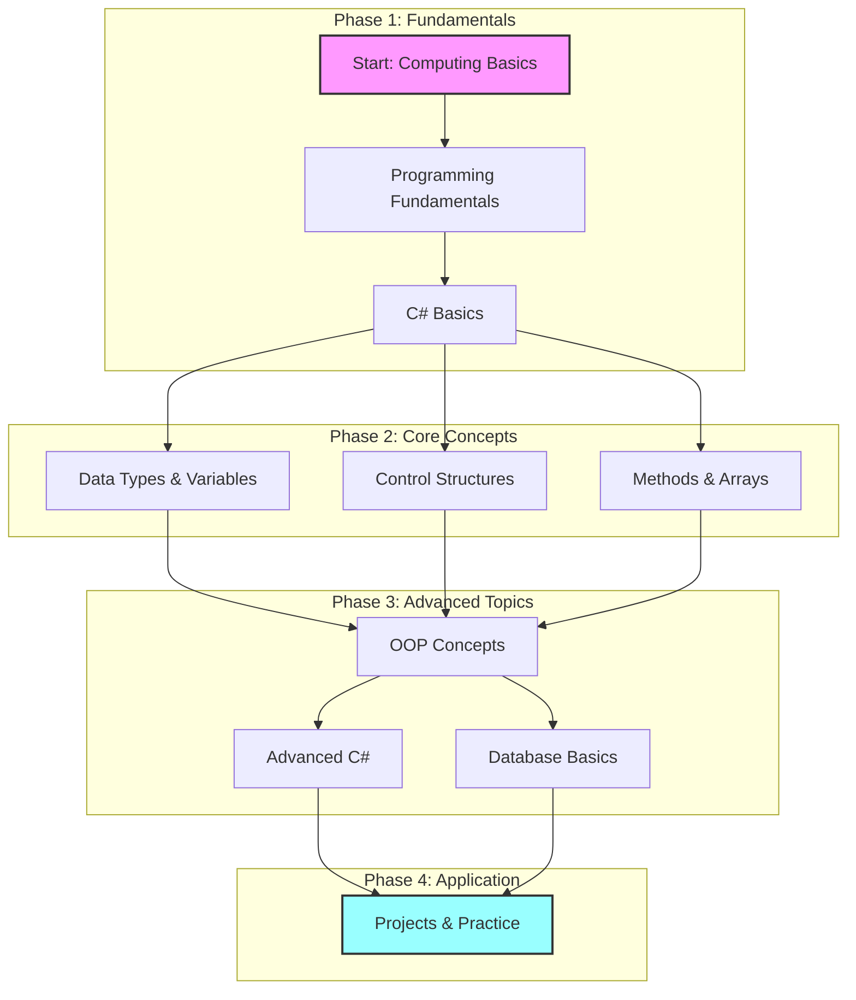

# CSharp04 .NET Development Course

**Course Duration:** September 2024 - January 2025  
**Start Date:** 08.09.2024  
**Format:** Twice Weekly Classes  
**Class Duration:** 2 hours per session
**Schedule:** Saturday and Sunday
**Language:** English  
**Instructor:** Parviz Rovshan Aliyev  
**Location:** Online Platform  

---

## Quick Navigation
[📚 Course Overview](#course-overview) | 
[🎯 Prerequisites](#prerequisites) | 
[🛠️ Development Environment](#development-environment) | 
[📖 Table of Contents](#table-of-contents)

---

** Student Information
| Name | GitHub Profile | Email |
|------|---------------|--------|
| Ceyhun | [@Ceyhun555](https://github.com/Ceyhun555) | [Email] |

---

## Course Overview

This intensive course is structured to take you from the basics of computing to professional C# development. Through hands-on projects and practical exercises, you'll learn to build robust applications using C# and the .NET framework.

### What You'll Learn
- Fundamentals of computing and networking
- C# programming language from basics to advanced concepts
- Object-Oriented Programming principles
- Working with databases and data structures
- Building real-world applications
- Best practices in software development

### Career Opportunities
- .NET Developer
- Software Engineer
- Backend Developer
- Full-stack Developer
- Application Developer

### Course Flow

### Learning Path Breakdown
1. **Phase 1: Fundamentals**
   - Computing basics and networking
   - Programming concepts
   - Introduction to C# and .NET

2. **Phase 2: Core Concepts**
   - Working with data types
   - Control structures and logic
   - Methods and arrays

3. **Phase 3: Advanced Topics**
   - Object-Oriented Programming
   - Advanced C# features
   - Database fundamentals

4. **Phase 4: Application**
   - Real-world projects
   - Code reviews
   - Best practices implementation

---

** Learning Resources

### Official Documentation
- [Official C# Documentation](https://docs.microsoft.com/en-us/dotnet/csharp/)
- [C# Programming Guide](https://docs.microsoft.com/en-us/dotnet/csharp/programming-guide/)
- [.NET Documentation](https://docs.microsoft.com/en-us/dotnet/)
- [Visual Studio Documentation](https://docs.microsoft.com/en-us/visualstudio/ide/)
- [Git Documentation](https://git-scm.com/doc)

---

## Prerequisites

### Technical Requirements
- Computer with Windows OS (Windows 10 or later recommended)
- Minimum 8GB RAM (16GB recommended)
- At least 50GB free disk space
- Stable internet connection (minimum 5Mbps)

### Knowledge Requirements
- Basic computer literacy
- Basic understanding of programming concepts (helpful but not required)
- English language proficiency
- Problem-solving aptitude

---

** Development Environment

### Required Software
- **IDE:** Visual Studio 2022 Community Edition
- **Framework:** .NET 6.0+
- **Version Control:** Git & GitHub
- **Additional Tools:**
  - SQL Server Management Studio
  - Postman
  - Visual Studio Code (optional)
---

## Table of Contents

### [Month 01](#month-01)

1. **[Introduction to Computing - Week 01, Day 01 - 08.09.2024](#week01-day01-08092024)**  
   Basics of computing, introduction to networking, and the difference between frontend and backend.

2. **[Data Flow and Networking Basics - Week 02, Day 01 - 14.09.2024](#week02-day01-14092024)**  
   Understanding data flow, networking protocols, and different network topologies.

3. **[Introduction to Programming Languages - Week 03, Day 01 - 21.09.2024](#week03-day01-21092024)**  
   Explore the history, classifications, and purposes of programming languages.

4. **[Introducing C# and .NET - Week 03, Day 02 - 22.09.2024](#week03-day02-22092024)**  
   Introduction to C#, the .NET framework, and Visual Studio as a development tool.

5. **[C# and .NET Differences - Week 04, Day 01 - 28.09.2024](#week04-day01-28092024)**  
   Key differences between C# programming language and the .NET framework.

6. **[C# Data Types and Value Types - Week 04, Day 02 - 29.09.2024](#week04-day02-29092024)**  
   Overview of C# data types, including value types and reference types.

7. **[C# Stack vs Heap Memory - Week 05, Day 01 - 04.10.2024](#week05-day01-04102024)**  
   Differences between stack and heap memory allocation in C#.

8. **[C# Output, Comments, and Variables - Week 05, Day 02 - 06.10.2024](#week05-day02-06102024)**  
   Basics of output statements, comments, and variables in C#.

---

### [Month 02](#month-02)

9. **[Type Casting and User Input in C# - Week 06, Day 01 - 13.10.2024](#week06-day01-13102024)**  
   Understanding type conversions and handling user input in C#.

10. **[C# Operators and Math - Week 07, Day 01 - 19.10.2024](#week07-day01-19102024)**  
    Dive into operators and mathematical operations in C#.

11. **[C# Strings - Week 08, Day 01 - 26.10.2024](#week08-day01-26102024)**  
    String handling and manipulation techniques in C#.

12. **[C# If...Else and Switch Statements - Week 08, Day 02 - 27.10.2024](#week08-day02-27102024)**  
    Implement conditional branching with if-else and switch statements.

13. **[C# Loops - Week 09, Day 01 - 03.11.2024](#week09-day01-03112024)**  
    Explore loop constructs in C#, including for, while, and do-while loops.

14. **[C# Loops Continued - Week 10, Day 01 - 09.11.2024](#week10-day01-09112024)**  
    Advanced examples and scenarios involving loops in C#.

15. **[Quiz Game Practice - Week 11, Day 01 - 11.11.2024](#week11-day01-11112024)**  
    Apply concepts in a practical session with a quiz game.

16. **[C# Arrays and Methods - Week 12, Day 01 - 17.11.2024](#week12-day01-17112024)**  
    Introduction to arrays and the basics of methods in C#.

---

### [Month 03](#month-03)

17. **[C# Advanced Arrays and Methods - Week 13, Day 01 - 01.12.2024](#week13-day01-01122024)**  
    Advanced techniques with arrays and method overloading in C#.

18. **[C# Classes and Objects - Week 14, Day 01 - 08.12.2024](#week14-day01-08122024)**  
    Dive into object-oriented programming with classes and objects in C#.

19. **[C# Variable Scope and Constructors - Week 15, Day 01 - 14.12.2024](#week15-day01-14122024)**  
    Learn about variable scope and the role of constructors in C#.

20. **[C# Object Type, Boxing, and Unboxing - Week 16, Day 01 - 21.12.2024](#week16-day01-21122024)**  
    Key concepts about the `object` type, boxing, and unboxing.

21. **[Encapsulation and Destructors - Week 16, Day 02 - 22.12.2024](#week16-day02-22122024)**  
    Explore the principles of encapsulation and destructors in object-oriented programming.

22. **[Repeat of week 16 - Week17, Day 01 - 04.01.2025](#week17-day01-04012025)**
    Repeat of week 16.

23. **[Introduction to Inheritance in C# - Week18, Day 01 - 11.01.2025](#week18-day01-11012025)**
    Introduction to Inheritance in C#

24. **[Types of Inheritance in C# - Week18, Day 02 - 11.01.2025](#week18-day02-121012025)** 
    Types of Inheritance in C#,Method Hiding, Shadowing, and Overriding in C# Explained with Examples
    
---

### [Month 04](#month-04)

25. **[Review of homework related to Inheritance - Week19, Day 01 - 19.01.2025](#week19-day01-19012025)**
    Review and discussion of Week 18 inheritance tasks .

26. **[Library Management System part 1 - Week19, Day 02 - 20.01.2025](#week19-day02-20012025)**
    part1.Build a console-based Library Management System to practice inheritance, encapsulation, and polymorphism. 
    Implement features like user authentication, book management, and basic CRUD operations.

27. **[Library Management System part 2 - Week20, Day 01 - 26.01.2025](#week20-day01-26012025)**
    part2. Continue building the Library Management System.

28. **[Library Management System part 3 & Polymorphism in C# - Week21, Day 01 - 01.02.2025](#week21-day01-01022025)**
    part3.Continue building the Library Management System & Polymorphism in C#.

29. **[Polymorphism in C# Examples - Week22, Day 01 - 08.02.2025](#week22-day01-08022025)**
    Polymorphism in C# Examples.

30. **[OOP Abstraction Abstract Classes and Methods - Week22, Day 02 - 09.02.2025](#week22-day02-09022025)**
    Deep dive into abstract classes and their implementation.

31. **[OOP Abstraction Interfaces - Week23, Day 01 - 15.02.2025](#week23-day01-15022025)**
    Understanding interfaces, their implementation, and best practices in C#.

32. **[OOP Partial Classes and Sealed Classes - Week23, Day 02 - 16.02.2025](#week23-day02-16022025)**
    Understanding partial classes and sealed classes in C#, their use cases and implementation.
---

### [Month 05](#month-05)

33. **[Week 23 Review and Homework Discussion - Week24, Day 01 - 23.02.2025](#week24-day01-23022025)**
    Review and discussion of Week 23 homework assignments covering interfaces, partial classes and sealed classes.

34. **[Static Classes and Extension Methods in C# - Week25, Day 01 - 08.03.2025](#week25-day01-08032025)**
    Understanding static classes, their use cases, and implementing extension methods in C#.

35. **[Static Constructors in C# - Week26, Day 01 - 15.03.2025](#week26-day01-15032025)** 
    Understanding static constructors, their initialization, and best practices in C#.

36. **[Exception Handling in C# - Week26, Day 02 - 16.03.2025](#week26-day02-15032025)**
    Learning about exception handling, try-catch blocks, custom exceptions, and error management in C#.

37. **[Global Exception Handling and File Handling in C# - Week27, Day 01 - 30.03.2025](#week27-day01-30032025)**
    Understanding global exception handling, working with files using FileStream and StreamWriter, and performing read/write operations in C#.

38. **[File Handling in C# - Week28, Day 01 - 12.04.2025](#week28-day01-12042025)**
    Understanding FileInfo, DirectoryInfo, and advanced file handling operations in C#.

39. **[Unmanaged Code Dispose Pattern and File Handling - Week28, Day 02 - 13.04.2025](#week28-day02-13042025)**
    Understanding the dispose pattern for unmanaged resources and implementing IDisposable interface in C#.

40. **[Practice File Handling Week28 Homework - LogFileManager with Exception Handling - Week29, Day 01 - 20.04.2025](#week29-day01-20042025)**
    Implementing LogFileManager with proper exception handling, file operations, and resource management in C#.

----

### [Month 06](#month-06)

41. **[Introduction to Collections in C# - Week30, Day 01 - 26.04.2025](#week30-day01-26042025)**
    Understanding different types of collections in C# including indexed based, key-value pair, prioritized collections, and specialized collections.

42. **[Collections in C# - Non-generic ArrayList and Array vs ArrayList - Week31, Day 01 - 04.05.2025](#week31-day01-04052025)**
    Understanding non-generic collections like ArrayList and comparing performance and implementation differences between array-based and ArrayList-based approaches.
     Rewriting the Library Management System (#Week19) project to use ArrayList instead of arrays.

43. **[Collections in C# - Non-generic Hashtable and Stack - Week33, Day 01 - 18.05.2025](#week33-day01-18052025)**
    Understanding non-generic collections like Hashtable and Stack, their use cases, implementation patterns and performance characteristics in C#.

44. **[Collections in C# - Non-generic Queue and Review Week31,33 Tasks - Week34, Day 01 - 24.05.2025](#week34-day01-24052025)**
    Understanding non-generic Queue collection, its FIFO behavior, implementation patterns and reviewing previous collection tasks. 

45. **[Collections in C# - Non-generic SortedList and Binary Search, Introduction to SQL Server basics - Week35, Day 01 - 01.06.2025](#week35-day01-01062025)**
    Understanding non-generic SortedList collection, implementing binary search algorithms, and introduction to SQL Server basics including connecting via SSMS and writing basic SELECT queries.

46. **[Practice and Review Week35 Tasks, Introduction to SQL Server Basics - Week36, Day 01 - 09.06.2025](#week36-day01-09062025)**
    Practice and review of Week35 collection tasks, introduction to SQL Server basics including connecting via SSMS and writing basic SELECT queries.

47. **[SQL Fundamentals - SELECT, DISTINCT, WHERE, ORDER BY, AND/OR/NOT Operators and SQL Data Types - Week37, Day 01 - 28.06.2025](#week37-day01-28062025)**
    Understanding SQL fundamentals including SELECT statements, DISTINCT keyword, WHERE clause with comparison operators, ORDER BY for sorting, logical operators (AND/OR/NOT), and comprehensive overview of SQL data types.

48. **[Complete Week35 Phone Book Management System Task - Introduction to Regular Expressions - Week37, Day 02 - 29.06.2025](#week37-day02-29062025)**
    Completing the Week35 Phone Book Management System project with comprehensive implementation, introduction to regular expressions for data validation, and advanced input processing techniques.

---

### [Month 07](#month-07)

49. **[SQL Practice - Creating Shopping Database: Customer, Order, OrderDetail, and Product Tables - Week38, Day 01 - 06.07.2025](#week38-day01-06072025)**
    Practicing SQL by designing and creating a shopping database, including tables for Customer, Order, OrderDetail, and Product, and understanding relationships between them.

50. **[SQL Practice - INSERT, UPDATE Commands on Shopping Database - Week39, Day 01 - 19.07.2025](#week39-day01-19072025)**
    Practicing SQL INSERT INTO and UPDATE commands on the shopping database, working with Customer, Order, OrderDetail, and Product tables to perform data manipulation operations.

51. **[SQL Practice - DELETE Statement, TOP, LIMIT, FETCH FIRST, ROWNUM, Aggregate Functions, LIKE Operator, and Wildcards - Week40, Day 01 - 27.07.2025](#week40-day01-27072025)**
    Practicing SQL DELETE statement, using SQL TOP, LIMIT, FETCH FIRST, or ROWNUM clauses for row selection, working with SQL aggregate functions, and understanding the LIKE operator and wildcards for pattern matching in SQL.

52. **[SQL Practice - ALTER TABLE Statement: ADD COLUMN, DROP COLUMN, RENAME COLUMN, ALTER/MODIFY DATATYPE, Subqueries - Week41, Day 01 - 10.08.2025](#week41-day01-10082025)**
    Practicing SQL ALTER TABLE statement including adding columns, dropping columns, renaming columns, altering/modifying data types, and working with subqueries.
## Month 01

### Week01-Day01 08.09.2024
#### [Introduction to Computing](#week01-day01-08092024)

### Topics
- Computer Networking Basics: Understanding Network Components
- Frontend vs Backend

### Resources

1. [Computer Networking Basics](https://www.geeksforgeeks.org/basics-computer-networking)
2. [frontend-vs-backend](https://www.computerscience.org/bootcamps/resources/frontend-vs-backend/)

[Back to Top](#table-of-contents)

---

### Week02-Day01 14.09.2024
#### [Data Flow and Networking Basics](#week02-day01-14092024)

### Topics
1. Computer Networking Basics: Understanding Network Components
2. Understanding Data Flow: Simplex, Half Duplex, and Full Duplex Communication
3. Peer-to-Peer Network
4. Client-Server Network
5. Types of Networks
    - LAN (Local Area Network)
    - MAN (Metropolitan Area Network)
    - WAN (Wide Area Network)
6. Network Topologies:
    - Bus Topology
    - Star Topology
    - Ring Topology
    - Mesh Topology
7. Networking Protocols:
    - TCP/IP
    - HTTP
    - FTP
    - SMTP
8. IP Addresses:
    - IPv4
    - IPv6
9. Network Services:
    - DNS (Domain Name System)
    - DHCP (Dynamic Host Configuration Protocol)
10. Difference Between Hardware and Software
11. What is an Operating System (OS)?

### Resources

1. [How Does the Internet Work?](https://cs.fyi/guide/how-does-internet-work)
2. [The Internet: A Technical Overview](https://www.vox.com/2014/6/16/18076282/the-internet)
3. [What is the Internet?](https://roadmap.sh/guides/what-is-internet)
4. [Introduction to Programming Languages](https://www.geeksforgeeks.org/introduction-to-programming-languages/)
5. [Client-Side vs Server-Side: What's the Difference?](https://medium.com/@donotapply/client-side-vs-server-side-whats-the-difference-a933341cd60e)
6. [Video: Computer Networking Basics](https://www.youtube.com/watch?v=DrI2lUXL1no)
7. [Analyze HTTP Requests and Responses with Chrome DevTools](https://egghead.io/lessons/chrome-devtools-analyze-http-requests-and-responses-with-chrome-devtools)
8. [How to Inspect HTTP Requests and Responses](https://dev.to/annoh_karlgusta/how-to-inspect-http-requests-and-responses-3nea)
9.  [Difference Between Hardware and Software](https://www.simplilearn.com/difference-between-hardware-software-article) - This article on Simplilearn discusses the fundamental distinctions between hardware and software in computing.
10. [What is an Operating System (OS)?](https://www.techtarget.com/whatis/definition/operating-system-OS) - TechTarget provides a comprehensive definition and explanation of operating systems, a crucial component of computing environments.
11. [SSD vs HDD: Which is Right for You?](https://www.crucial.com/articles/about-ssd/ssd-vs-hdd) - Crucial's article compares Solid State Drives (SSD) and Hard Disk Drives (HDD), highlighting their differences, advantages, and use cases.
    
[Back to Top](#table-of-contents)

---

### Week03-Day01 21.09.2024
#### [Introduction to Programming Languages](#week03-day01-21092024)

### Topics
1. Introduction to Programming Languages
2. A History of Programming Languages
3. Why Study Programming Languages?
4. Classifications of Programming Languages
5. Compilation vs. Interpretation
6. Implementation Strategies
7. Programming Environment Tools
8. An Overview of Compilation

### Resources

1. [Introduction to Programming Languages - GeeksforGeeks](https://www.geeksforgeeks.org/introduction-to-programming-languages/)
2. [Introduction to Programming Languages (PDF) - Stony Brook University](https://www3.cs.stonybrook.edu/~pfodor/courses/CSE260/_L01_Introduction_Programming_Languages.pdf)
3. [Introduction to Computer Programming Languages - LinkedIn Article](https://www.linkedin.com/pulse/introduction-computer-programming-languages-chukwuebuka-ejie-vi6mf/)
4. [Programming Language Overview - JavaTpoint](https://www.javatpoint.com/programming-language)

[Back to Top](#table-of-contents)

---

### Week03-Day02 22.09.2024
#### [Introducing C# and .NET](#week03-day02-22092024)

### Topics
1. Introducing C# and .NET
2. What is Visual Studio?

### Resources
1. [C# Get Started](https://www.w3schools.com/cs/cs_getstarted.php)
2. [GeeksforGeeks - C# Programming Language](https://www.geeksforgeeks.org/csharp-programming-language/?ref=lbp)
3. [Dot Net Tutorials - Introduction to C# Language](https://dotnettutorials.net/lesson/introduction-to-csharp-language/)
4. [Medium - What is C# and .NET](https://medium.com/@codebob75/what-is-c-and-net-41addd28b173)
5. [Medium - What is .NET](https://medium.com/@benkaddourmed54/what-is-net-202790532234)
6. [Introduction-to-visual-studio](https://www.geeksforgeeks.org/introduction-to-visual-studio/)
7. [What is Visual Studio?](https://learn.microsoft.com/en-us/visualstudio/get-started/visual-studio-ide?view=vs-2022)
8. [Introduction to Microsoft Visual Studio - tutorial](https://www.functionx.com/csharp10/Lesson01.htm)

[Back to Top](#table-of-contents)

---

### Week04-Day01 28.09.2024
#### [C# and .NET Differences](#week04-day01-28092024)

### Topics
1. What is the difference between C# and .Net ?
2. C# Programming Language

### Resources
1. [What is the difference between C# and .Net ?](https://medium.com/@codebob75/what-is-c-and-net-41addd28b173)
2. [GeeksforGeeks - C# Programming Language](https://www.geeksforgeeks.org/csharp-programming-language/?ref=lbp)
3. [Dot Net Tutorials - Introduction to C# Language](https://dotnettutorials.net/lesson/introduction-to-csharp-language/)
4. [Medium - What is C# and .NET](https://medium.com/@codebob75/what-is-c-and-net-41addd28b173)
5. [Medium - What is .NET](https://medium.com/@benkaddourmed54/what-is-net-202790532234)
   [Back to Top](#table-of-contents)

[Back to Top](#table-of-contents)

---

### Week04-Day02 29.09.2024
#### [C# Data Types and Value Types](#week04-day02-29092024)

### Topics
1. Common Language Runtime(CLR)
2. .NET Common Language Runtime (CLR)
3. Value Types and Reference Types
4. C# - Data Types
5. Numbers in C#

### Resources
1. [Common Language Runtime(CLR)](https://ismailkasan.medium.com/common-language-runtime-clr-14583bebbcf5)
2. [.NET Common Language Runtime (CLR)](https://www.javatpoint.com/net-common-language-runtime)
3. [Value Type and Reference Type](https://www.tutorialsteacher.com/csharp/csharp-value-type-and-reference-type)
4. [C#'ta Value Type ve Reference Type](https://handeebrar.medium.com/c-ta-value-type-ve-reference-type-178d3a5823ac))
5. [C# - Data Types](https://www.tutorialsteacher.com/csharp/csharp-data-types)
6. [Numbers in C#](https://www.tutorialsteacher.com/csharp/numbers)
7. [Drawing](https://excalidraw.com/#json=B3eaRkAjEB8MqM8hca-rV,-c8aVtlmegDwxfhXn2F5mw)

[Back to Top](#table-of-contents)

---

### Week05-Day01 04.10.2024
#### [C# Stack vs Heap Memory](#week05-day01-04102024)

### Topics
1. C# Stack vs Heap Memory

### Resources
1. [C# Stack vs Heap Memory](https://medium.com/@CodeWithHonor/c-stack-vs-heap-memory-f8a737af9919)
2. [Mülakat #2 - Heap ve Stack](https://medium.com/software-development-turkey/mülakat-2-heap-ve-stack-e37f82b4c49b)

[Back to Top](#table-of-contents)

---

### Week05-Day02 06.10.2024
#### [C# Output, Comments, and Variables](#week05-day02-06102024)

### Topics
1. C# Output
2. C# Comments
3. C# Variables - Value Types

[link](https://excalidraw.com/#json=OJQuwooUgMqH7RR2JcgcC,d0K9WjpdmkvxVlCbgR-yNA)

### Resources
1. [C# Output](https://www.w3schools.com/cs/cs_output.php)
2. [C# Comments](https://www.w3schools.com/cs/cs_comments.php)
3. [C# Variables](https://www.w3schools.com/cs/cs_variables.php)
4. [C# Variables](https://www.tutorialsteacher.com/csharp/csharp-variable)

### **Homework Assignment**
[Week05 Tasks](https://github.com/parvizrovshanaliyev/CSharp04/blob/main/ConsoleApps/Week05/DataTypes.ValueTypes/tasks.md)

[Back to Top](#table-of-contents)

---

## Month 02

### Week06-Day01 13.10.2024
#### [Type Casting and User Input in C#](#week06-day01-13102024)

### Topics
1. Type Casting in C#
2. User Input in C#

### Resources
1. [Type Casting in C#](https://www.w3schools.com/cs/cs_type_casting.php)
2. [Type Casting in C#](https://www.geeksforgeeks.org/c-sharp-type-casting/)
3. [User Input in C#](https://www.w3schools.com/cs/cs_user_input.php)

### **Homework Assignment**

[Week06 Tasks](https://github.com/parvizrovshanaliyev/CSharp04/blob/main/ConsoleApps/Week06/UserInput/Tasks.md)

### Questions for Type Casting

1. What is type casting in C#?
2. Explain the difference between implicit and explicit type casting.
3. What are the potential risks of explicit type casting?
4. Provide an example of implicit type casting.
5. Provide an example of explicit type casting.
6. What is the `Convert` class used for in C#?

[Back to Top](#table-of-contents)

---

### Week07-Day01 19.10.2024
#### [C# Operators and Math](#week07-day01-19102024)

### Topics
1. Demystifying Type Conversion in C#: A Comprehensive Guide
2. C# Operators
3. C# Math

### Resources
1. [Demystifying Type Conversion in C#: A Comprehensive Guide](https://medium.com/@praveen.rao.g.1990/demystifying-type-conversion-in-c-a-comprehensive-guide-0cd1c2e3c1db)
2. [C# Operators](https://www.w3schools.com/cs/cs_operators.php)
3. [C# Math](https://www.w3schools.com/cs/cs_math.php)

### **Homework Assignment**
[Week07 Tasks](https://github.com/parvizrovshanaliyev/CSharp04/blob/main/ConsoleApps/Week07/Practice/Tasks.md)

[Back to Top](#table-of-contents)

---

### Week08-Day01 26.10.2024
#### [C# Strings](#week08-day01-26102024)

### Topics
1. C# Strings

### Resources
1. [1 C# Strings](https://www.w3schools.com/cs/cs_strings.php)
2. [2 C# Strings](https://www.programiz.com/csharp-programming/string)
3. [3 Working with Strings in C#: A Comprehensive Guide](https://medium.com/@praveen.rao.g.1990/working-with-strings-in-c-a-comprehensive-guide-242ca55934b0)

[Back to Top](#table-of-contents)

---

### Week08-Day02 27.10.2024
#### [C# If...Else and Switch Statements](#week08-day02-27102024)

### Topics
1. Difference between String and StringBuilder in C#
2. C# If ... Else
3. C# Switch

### Resources
1. [Difference between String and StringBuilder in C#](https://petercodes.hashnode.dev/difference-between-string-and-stringbuilder-in-c)
2. [String vs StringBuilder in C#: Choosing the Right Tool for Efficient String Manipulation](https://medium.com/@chandrashekharsingh25/string-vs-stringbuilder-in-c-choosing-the-right-tool-for-efficient-string-manipulation-6beca8ca6450)
3. [1 C# If ... Else](https://www.w3schools.com/cs/cs_conditions.php)
4. [2 C# - if, else if, else Statements](https://www.tutorialsteacher.com/csharp/csharp-if-else)
5. [1 C# Switch](https://www.w3schools.com/cs/cs_switch.php)
6. [2 Better C# Switch Statements for a Range of Values](https://hackajob.com/talent/blog/better-c-switch-statements-for-a-range-of-values)
6. [3 C# switch Statement](https://www.programiz.com/csharp-programming/switch-statement)

### **Homework Assignment**

[Week08 Tasks - Strings](https://github.com/parvizrovshanaliyev/CSharp04/blob/main/ConsoleApps/Week08/Strings/Tasks.md)
---
[Week08 Tasks - C# If ... Else](https://github.com/parvizrovshanaliyev/CSharp04/blob/main/ConsoleApps/Week08/Condition.IfStatement/Tasks.md)
---
[Week08 Tasks - C# Switch](https://github.com/parvizrovshanaliyev/CSharp04/blob/main/ConsoleApps/Week08/Condition.SwitchCaseStatement/Tasks.md)

[Back to Top](#table-of-contents)

---

### Week09-Day01 03.11.2024
#### [C# Loops](#week09-day01-03112024)

### code practice

### Resources
1. [String methods in C#](https://www.programiz.com/csharp-programming/library/string/compare)
2. [String methods in C#](https://www.youtube.com/watch?v=Kk9YoxY_kO0&pp=ygUUZ2VuY2F5IHlpbGRpeiBzdHJpbmc%3D)
3. [String in C#](https://www.youtube.com/watch?v=d7oYjvXJ7po&pp=ygUUZ2VuY2F5IHlpbGRpeiBzdHJpbmc%3D)

[Back to Top](#table-of-contents)

---

### Week10-Day01 09.11.2024
#### [C# Loops](#week10-day01-09112024)

### Topics
1. C# While Loop
2. C# The Do/While Loop
3. C# For Loop
4. C# Break and Continue

### Resources
1. [C# While Loop & C# The Do/While Loop](https://www.w3schools.com/cs/cs_while_loop.php)
2. [C# For Loop](https://www.w3schools.com/cs/cs_for_loop.php)
3. [C# Break and Continue](https://www.w3schools.com/cs/cs_break.php)

### **Homework Assignment**

[Week10 Tasks - Loops](https://github.com/parvizrovshanaliyev/CSharp04/blob/main/ConsoleApps/Week10/Practice/Tasks.md)

[Back to Top](#table-of-contents)

---

### Week11-Day01 11.11.2024
#### [Quiz Game Practice](#week11-day01-11112024)

### Topics
1. Practice
2. ATM program

### **Homework Assignment**

[Back to Top](#table-of-contents)

---

### Week12-Day01 17.11.2024
#### [C# Arrays and Methods](#week12-day01-17112024)

### Topics
1. C# Arrays
2. C# Methods
3. GIT

[Download Image](https://github.com/parvizrovshanaliyev/CSharp04/blob/main/images/reference_types_array.png)

### Resources
1. [1. C# Arrays](https://www.w3schools.com/cs/cs_arrays.php)
2. [2. C# Arrays](https://www.programiz.com/csharp-programming/arrays)
3. [C# Methods](https://www.w3schools.com/cs/cs_methods.php)
4. [Git](https://medium.com/@parvizrovshanaliyev/git-n%C9%99dir-38604f516522)

### **Homework Assignment**

[Week12 Tasks - C# Arrays](https://github.com/parvizrovshanaliyev/CSharp04/blob/main/ConsoleApps/Week12/Practice/Tasks.Array.md)
---
[Week12 Tasks - C# Methods](https://github.com/parvizrovshanaliyev/CSharp04/blob/main/ConsoleApps/Week12/Practice/Tasks.Method.md)

[Back to Top](#table-of-contents)

---

## Month 03

### Week13-Day01 01.12.2024
#### [C# Advanced Arrays and Methods](#week13-day01-01122024)

### Topics
1. C# Arrays
  - Loop Through Arrays
  - Sort Arrays
  - Multidimensional Arrays
2. C# Methods
  - Parameters and Arguments
  - Default Parameter Value
  - Return Values
  - Named Arguments
  - Method Overloading
  - ref vs out in C#
3. C# OOP
  - C# - What is OOP?
  - C# Classes and Objects

### Resources
1. [1. C# Arrays](https://www.w3schools.com/cs/cs_arrays.php)
2. [2. C# Arrays](https://www.programiz.com/csharp-programming/arrays)
3. [C# Methods](https://www.w3schools.com/cs/cs_methods.php)
4. [ref vs out in C#](https://www.c-sharpcorner.com/UploadFile/ff2f08/ref-vs-out-keywords-in-C-Sharp/)
5. [C# OOP](https://www.w3schools.com/cs/cs_oop.php)
6. [Object Oriented Programming (OOPs) in C#](https://dotnettutorials.net/lesson/object-oriented-programming-csharp/)
7. [C# OOP-Obyekt Anatomiyası — Reference Types olan Dəyişənlər](https://medium.com/@mahammadbuludzada/c-oop-obyekt-anatomiyas%C4%B1-reference-types-olan-d%C9%99yi%C5%9F%C9%99nl%C9%99r-d924c41d4d32)

### **Homework Assignment**

[Week13 Tasks - C# Arrays & Methods](https://github.com/parvizrovshanaliyev/CSharp04/blob/main/ConsoleApps/Week13/Practice/Tasks.md)

[Back to Top](#table-of-contents)

---

### Week14-Day01 08.12.2024
#### [C# Classes and Objects](#week14-day01-08122024)

### Topics
1. [C# -  Classes and Objects](ConsoleApps/Week14/OOP.ClassAndObject/README.md)
2. C# -  Class Members
      -  Fields
      -  Properties
      -  Constructors
      -  Methods
      -  This

### Resources
1. [C# -  Classes and Objects](https://www.w3schools.com/cs/cs_classes.php)
2. [C# Class Members](https://www.w3schools.com/cs/cs_class_members.php)
3. [C# Class](https://www.tutorialspoint.com/csharp/csharp_classes.htm )
4. [C# this Keyword](https://www.programiz.com/csharp-programming/this-keyword)
5. [C# Variable Scope](https://www.programiz.com/csharp-programming/variable-scope)
6. [C# Constructor](https://www.programiz.com/csharp-programming/constructors)
7. [C# Properties (Get and Set)](https://www.w3schools.com/cs/cs_properties.php)
8. [Video -1. Object Programming in C#](https://www.youtube.com/watch?v=48Z75_jZHv0&list=PLQVXoXFVVtp306cqgKyC8NoxCmHIuWVBK&index=1&ab_channel=GençayYıldız)
9. [Video -2. Object Programming in C# - Class](https://www.youtube.com/watch?v=9_7pa5ZHaa4&list=PLQVXoXFVVtp306cqgKyC8NoxCmHIuWVBK&index=2&ab_channel=GençayYıldız)
10.[Video -3. Object Programming in C# - Class Members](https://www.youtube.com/watch?v=3CC4EFcqMWM&list=PLQVXoXFVVtp306cqgKyC8NoxCmHIuWVBK&index=3&ab_channel=GençayYıldız) 

[Back to Top](#table-of-contents)

---

### Week15-Day01 14.12.2024
#### [C# Variable Scope and Constructors](#week15-day01-14122024)

### Topics
1. C# Variable Scope
2. [C# Constructors](ConsoleApps/Week15/OOP.Class.Constructor/README.md)
3. [Types of Constructors in C#](ConsoleApps/Week15/OOP.Class.Constructor/README.md)

### Resources
1. [C# Variable Scope](https://www.programiz.com/csharp-programming/variable-scope)
2. [C# Constructors](https://dotnettutorials.net/lesson/constructors-csharp/)
3. [Types of Constructors in C#](https://dotnettutorials.net/lesson/types-of-constructors-in-csharp/)
4. [Why We Need Constructors in C#](https://dotnettutorials.net/lesson/why-do-we-need-constructors-in-csharp/)

### **Homework Assignment**

[Week15 Tasks - Task 1. Book](https://github.com/parvizrovshanaliyev/CSharp04/blob/main/ConsoleApps/Week15/Practice/task-1-book.md)
---
[Week15 Tasks - Task 2. Car](https://github.com/parvizrovshanaliyev/CSharp04/blob/main/ConsoleApps/Week15/Practice/task-2-car.md)
---
[Week15 Tasks - Task 3. Product](https://github.com/parvizrovshanaliyev/CSharp04/blob/main/ConsoleApps/Week15/Practice/task-3-product.md)

[Back to Top](#table-of-contents)

---

### Week16-Day01 21.12.2024
#### [C# Object Type, Boxing, and Unboxing](#week16-day01-21122024)

### Topics
1. [The `object` Type in C#  ](ConsoleApps/Week16/ObjectAndBoxingUnboxing/README.md)
2. [Boxing in C# ](ConsoleApps/Week16/ObjectAndBoxingUnboxing/README.md) 
3. [Unboxing in C# ](ConsoleApps/Week16/ObjectAndBoxingUnboxing/README.md) 
4. [Key Properties and Methods of the `object` Type  ](ConsoleApps/Week16/ObjectAndBoxingUnboxing/README.md)

### Resources
1. [Understanding `object` in C#](https://www.geeksforgeeks.org/c-sharp-object-class/)  
2. [C# Boxing and Unboxing](https://learn.microsoft.com/en-us/dotnet/csharp/programming-guide/types/boxing-and-unboxing)  
3. [Key Methods of `object` in C#](https://learn.microsoft.com/en-us/dotnet/api/system.object)  
4. [Performance Considerations for Boxing and Unboxing](https://psid23.medium.com/what-is-boxing-and-unboxing-in-c-how-does-is-affect-performance-and-how-to-prevent-common-a02d2a14a244)  

---

### **Homework Assignment**
[Week16 Tasks - Task 1. Object Methods](https://github.com/parvizrovshanaliyev/CSharp04/blob/main/ConsoleApps/Week16/Practice/task-1-object-methods.md)  
[Week16 Tasks - Task 2. Boxing and Unboxing](https://github.com/parvizrovshanaliyev/CSharp04/blob/main/ConsoleApps/Week16/Practice/task-2-boxing-unboxing.md)  
[Week16 Tasks - Task 3. Boxing Performance](https://github.com/parvizrovshanaliyev/CSharp04/blob/main/ConsoleApps/Week16/Practice/task-3-boxing-performance.md)  

[Back to Top](#table-of-contents)

---

### Week16-Day02 22.12.2024
#### [Encapsulation and Destructors](#week16-day02-22122024)

### Topics
1. [OOP - Encapsulation - Access Modifiers](ConsoleApps/Week16/OOP.AccessModifiersAndEncapsulation/README.md)
2. [OOP - Class - Destructor](ConsoleApps/Week16/OOP.Destructors/README.md)

### Resources
1. [C# Encapsulation](https://www.tutorialspoint.com/csharp/csharp_encapsulation.htm)  
2. [C# Access Modifiers](https://www.programiz.com/csharp-programming/access-modifiers)  
3. [C# Destructor](https://www.programiz.com/csharp-programming/destructor)  
---

### **Homework Assignment**
[Week16 Tasks - Task 4. OOP - Encapsulation - Access Modifiers](https://github.com/parvizrovshanaliyev/CSharp04/blob/main/ConsoleApps/Week16/Practice/task-4-encapsulation-access-modifiers.md)

[Back to Top](#table-of-contents)
---

### Week17-Day01 04.01.2025
#### [Repeat of week 16](#week17-day01-04012025)

### Topic
1. Boxing and Unboxing in C#
2. Access Modifiers in C#
3. Encapsulation in C#
4. Destructors in C#

### Resources
1. [Boxing and Unboxing in C#](https://dotnettutorials.net/lesson/boxing-and-unboxing-in-csharp/)  
2. [C# Access Modifiers](https://dotnettutorials.net/lesson/access-specifiers-csharp/)  
3. [Encapsulation in C#](https://dotnettutorials.net/lesson/encapsulation-csharp/)  
4. [Destructors in C#](https://dotnettutorials.net/lesson/destructor-csharp/)  

[Back to Top](#table-of-contents)
---

### Week18-Day01 11.01.2025
#### [Introduction to Inheritance in C#](#week18-day01-11012025)

### Topic
1. [Introduction to Inheritance in C#](ConsoleApps/Week18/OOp.Inheritance/README.md)
   -Understanding inheritance as a key OOP concept that enables code reuse, extensibility, and logical structuring of classes.

### Resources
1. [Inheritance in C#](https://dotnettutorials.net/lesson/inheritance-c-sharp/)

[Back to Top](#table-of-contents)
---

### Week18-Day02 12.01.2025
#### [Types of Inheritance in C#](#week18-day02-12012025)

### Topic
1. Types of Inheritance in C#
2. [Method Overriding in C# Inheritance](ConsoleApps/Week18/OOP.Inheritance.MethodOverriding/README.md)
3. [Access Modifiers in C# Inheritance](ConsoleApps/Week18/OOP.Inheritance.AccessModifiers/README.md)

### Resources
1. [Types of Inheritance in C#](https://dotnettutorials.net/lesson/types-of-inheritance-in-csharp/)
2. [How to use Inheritance in Application Development](https://dotnettutorials.net/lesson/how-to-use-inheritance-in-application-development/)
3. [Method Overriding](https://iqratechnology.com/academy/c-sharp-training/c-method-overriding/)
4. [Method Hiding, Shadowing, and Overriding in C# Explained with Examples](https://medium.com/@javvadirupasri8/method-hiding-shadowing-and-overriding-in-c-explained-with-examples-643c7dfc8ccc)

### **Homework Assignment**
[Week18 Tasks - Inheritance in C#](ConsoleApps/Week18/Practice/tasks.md)

[Back to Top](#table-of-contents)
---

## Month04

### Week19-Day01 19.01.2025
#### [Review of homework related to Inheritance](#week19-day01-19012025)

### Topic
1. Review and discussion of Week 18 inheritance tasks
2. Code review and best practices
3. Common inheritance patterns and anti-patterns
4. Q&A session on inheritance concepts

### Resources
1. [Week18 Tasks Solutions](ConsoleApps/Week18/Practice/solutions.md)
2. [Inheritance Best Practices](https://learn.microsoft.com/en-us/dotnet/csharp/fundamentals/tutorials/inheritance)

[Back to Top](#table-of-contents)
---

### Week19-Day02 20.01.2025
#### [Library Management System](#week19-day02-20012025)

### Topic
1. part 1- Building a Console-Based Library Management System
   - Implementing user authentication
   - Creating base and derived classes for library items
   - Applying inheritance and encapsulation principles

### Resources
1. [Project Documentation](ConsoleApps/Week19/LibraryManagementSystem/README.md)
2. [Learning Topics](ConsoleApps/Week19/LibraryManagementSystem/docs/learning_topics.md)

### **Project Assignment**
[Library Management System Project](ConsoleApps/Week19/LibraryManagementSystem/README.md)

[Back to Top](#table-of-contents)
---

### Week20-Day01 26.01.2025
#### [Library Management System Part 2](#week20-day01-26012025)

### Topic
1. part 2 - Enhancing the Library Management System
   - LibraryManager.cs
2. Difference between readonly and const keyword in C#

### Resources
1. [Project Documentation Part 2](ConsoleApps/Week19/LibraryManagementSystem/README.md)
2. [Difference between readonly and const keyword in C#](https://www.geeksforgeeks.org/difference-between-readonly-and-const-keyword-in-c-sharp/)

### **Project Assignment**
[Library Management System Project - Part 2](ConsoleApps/Week19/LibraryManagementSystem/README.md)

[Back to Top](#table-of-contents)
---

### Week21-Day01 01.02.2025
#### [Library Management System Part 3 & Polymorphism in C#](#week21-day01-01022025)

### Topic
1. Part 3 - Completing the Library Management System
   - Implementing polymorphic behavior
   - Adding advanced features
   - System testing and refinement
2. Introduction to Polymorphism in C#
   - Understanding polymorphic behavior
   - Runtime polymorphism vs compile-time polymorphism
   - Virtual and override keywords

### Resources
1. [Project Documentation Part 3](ConsoleApps/Week19/LibraryManagementSystem/README.md)
2. [Polymorphism in C#](https://dotnettutorials.net/lesson/polymorphism-csharp/)
3. [Virtual and Override Keywords](https://learn.microsoft.com/en-us/dotnet/csharp/language-reference/keywords/virtual)

### **Project Assignment**
[Library Management System Project - Final Phase](ConsoleApps/Week19/LibraryManagementSystem/README.md)

[Back to Top](#table-of-contents)
---

### Week22-Day01 08.02.2025
#### [Polymorphism in C# Examples](#week22-day01-08022025)

### Topic
1. Practical Examples of Polymorphism in C#

### Resources
1. [Polymorphism in C#](https://www.geeksforgeeks.org/polymorphism-in-c-sharp/)

### **Homework Assignment**
[Week22 Tasks - Polymorphism Examples](ConsoleApps/Week21/Practice/tasks.md)

[Back to Top](#table-of-contents)

---

### Week22-Day02 09.02.2025
#### [OOP Abstraction Abstract Classes and Methods](#week22-day02-09022025)

### Topic
1. Abstract Classes and Methods in C#
2. Practical Implementation of Abstract Classes
3. Polymorphism with Abstract Classes

### Resources
1. [Abstract Class and Abstract Methods in C#](https://dotnettutorials.net/lesson/abstract-class-abstract-methods-csharp/)
2. [Understanding Abstract Classes](https://www.tutorialsteacher.com/csharp/csharp-abstract-class)
3. [Understanding virtual and abstract in C#](https://medium.com/@nirajranasinghe/understanding-virtual-and-abstract-in-c-33cb0a7fcead)

[Back to Top](#table-of-contents)

---

### Week23-Day01 15.02.2025
#### [OOP Abstraction Interfaces](#week23-day01-15022025)

### Topic
1. Understanding Interfaces in C#
2. Interface Implementation Best Practices
3. Interface vs Abstract Classes
4. Multiple Interface Implementation
5. Default Interface Methods
6. Interface Segregation Principle

### Resources
1. [Interface in C#](https://dotnettutorials.net/lesson/interface-c-sharp/)
1. [Interfaces in C#](https://learn.microsoft.com/en-us/dotnet/csharp/language-reference/keywords/interface)
2. [Interface Best Practices](https://www.tutorialsteacher.com/csharp/csharp-interface)
3. [Interface vs Abstract Class](https://www.geeksforgeeks.org/difference-between-abstract-class-and-interface-in-c-sharp/)
4. [.NET Tutorial: Interfaces](https://learn.microsoft.com/en-us/dotnet/csharp/fundamentals/types/interfaces)

### **Homework Assignment**
[Week22 Tasks - Abstract Classes](ConsoleApps/Week22/Practice/tasks.md)
[Week23 Tasks - Interfaces](ConsoleApps/Week23/Practice/interface-tasks.md)

[Back to Top](#table-of-contents)

---
### Week23-Day02 16.02.2025
#### [OOP Partial Classes and Sealed Classes](#week23-day02-16022025)

### Topic
1. Understanding Partial Classes in C#
2. Implementing Partial Classes
3. Understanding Sealed Classes
4. Use Cases for Sealed Classes
5. Best Practices for Partial and Sealed Classes

### Resources
1. [Abstract Class vs Interface in C#: Pros and Cons](https://www.bytehide.com/blog/abstract-class-vs-interface-csharp)
2. [Partial Class and Partial Methods in C#](https://dotnettutorials.net/lesson/partial-classes-partial-methods-csharp/)
3. [Partial Classes and Methods](https://learn.microsoft.com/en-us/dotnet/csharp/programming-guide/classes-and-structs/partial-classes-and-methods)
4. [Sealed Class and Sealed Methods in C#](https://dotnettutorials.net/lesson/sealed-class-methods-csharp/)
5. [Sealed Classes in C#](https://www.geeksforgeeks.org/sealed-class-in-c-sharp/)
6. [When to Use Sealed Classes](https://www.tutorialsteacher.com/csharp/csharp-sealed-class)

### **Homework Assignment**
[Week23 Tasks - Partial Classes](ConsoleApps/Week23/Practice/partial-class-tasks.md)
[Week23 Tasks - Sealed Classes](ConsoleApps/Week23/Practice/sealed-class-tasks.md)

[Back to Top](#table-of-contents)

---

## Month05

### Week24-Day01 23.02.2025
#### [Week 23 Review and Homework Discussion](#week24-day01-23022025)

### Topics
1. Review of Week 23 Interface Concepts
2. Review of Week 23 Partial Classes Implementation
3. Review of Week 23 Sealed Classes Usage
4. Discussion of Homework Solutions

### Resources
1. [Interface Best Practices in C#](https://learn.microsoft.com/en-us/dotnet/csharp/programming-guide/interfaces/how-to-implement-interface-events)
2. [Partial Classes Design Patterns](https://www.c-sharpcorner.com/UploadFile/84c85b/using-partial-classes-in-C-Sharp-net/)
3. [When to Use Sealed Classes](https://stackoverflow.com/questions/7777611/when-should-i-use-sealed-class-in-c)
4. [C# Interface Implementation Guidelines](https://docs.microsoft.com/en-us/dotnet/standard/design-guidelines/interfaces)

### **Homework Assignment**
[Week12 Tasks - Array](ConsoleApps/Week12/ArrayRealExamples/tasks.md)

[Back to Top](#table-of-contents)

---

### Week25-Day01 08.03.2025
#### [Static Classes and Extension Methods in C#](#week25-day01-08032025)

### Topics
1. Understanding Static Classes
2. Static Class Members and Properties
3. Static Constructors
4. Extension Methods in C#
5. Creating and Using Extension Methods
6. Best Practices for Static Classes
7. Common Use Cases for Extension Methods

### Resources
1. [Static Class in C#](https://dotnettutorials.net/lesson/static-class-in-csharp/)
2. [Extension Methods in C#](https://dotnettutorials.net/lesson/extension-methods-csharp/)
3. [Static Classes and Static Class Members](https://learn.microsoft.com/en-us/dotnet/csharp/programming-guide/classes-and-structs/static-classes-and-static-class-members)
4. [Extension Methods in C#](https://learn.microsoft.com/en-us/dotnet/csharp/programming-guide/classes-and-structs/extension-methods)
5. [When to Use Static Classes vs Singleton](https://stackoverflow.com/questions/519520/difference-between-static-class-and-singleton-pattern)

### **Homework Assignment**
[Week25 Tasks - Static Classes](ConsoleApps/Week25/Practice/static-class-tasks.md)
[Week25 Tasks - Extension Methods](ConsoleApps/Week25/Practice/extension-methods-tasks.md)

[Back to Top](#table-of-contents)

---

### Week26-Day01 15.03.2025
#### [Static Constructors in C#](#week26-day01-15032025)

### Topics
1. Understanding Static Constructors
2. Static Constructor Initialization
3. Best Practices for Static Constructors
4. Common Pitfalls and How to Avoid Them

### Resources
1. [Static Constructor in C#](https://dotnettutorials.net/lesson/static-vs-non-static-constructors-in-csharp/)
2. [Static Constructor Implementation](https://learn.microsoft.com/en-us/dotnet/csharp/programming-guide/classes-and-structs/static-constructors)

### **Homework Assignment**
-

[Back to Top](#table-of-contents)

---

### Week26-Day02 16.03.2025
#### [Exception Handling in C#](#week26-day02-16032025)

### Topics
1. Understanding Exceptions in C#
2. Try-Catch Blocks
3. Multiple Catch Blocks
4. Finally Block
5. Custom Exceptions
6. Exception Handling Best Practices
7. Common Exception Types

### Resources
1. [Exception Handling in C#](https://dotnettutorials.net/lesson/exception-handling-csharp/)
2. [Try-Catch Blocks](https://learn.microsoft.com/en-us/dotnet/csharp/language-reference/keywords/try-catch)
3. [Creating Custom Exceptions](https://learn.microsoft.com/en-us/dotnet/standard/exceptions/how-to-create-user-defined-exceptions)
4. [Exception Handling Best Practices](https://learn.microsoft.com/en-us/dotnet/standard/exceptions/best-practices-for-exceptions)

### **Homework Assignment**
[Week26 Tasks - Exception Handling](ConsoleApps/Week26/Practice/exception-handling-tasks.md)

[Back to Top](#table-of-contents)

---

### Week27-Day01 30.03.2025
#### [Global Exception Handling and File Handling in C#](#week27-day01-30032025)

### Topics
1. Global Exception Handling
2. Working with Files in C#
3. FileStream and StreamWriter
4. File Read/Write Operations

### Resources
1. [Global Exception Handling in C#](ConsoleApps/Week26/GlobalExceptionDemo/Readme.md)
2. [File Handling in C#](https://dotnettutorials.net/lesson/file-handling-in-csharp/)
3. [Working with FileStream](https://dotnettutorials.net/lesson/filestream-class-in-csharp/)

[Back to Top](#table-of-contents)

---

### Week28-Day01 12.04.2025
#### [File Handling in C#](#week28-day01-12042025)

### Topics
1. FileInfo and DirectoryInfo Classes
2. Advanced File Operations
3. File System Monitoring
4. File Attributes and Security
5. Directory Operations
6. Path Class Operations

### Resources
1. [FileInfo Class Tutorial](https://dotnettutorials.net/lesson/fileinfo-class-in-csharp/#google_vignette)
2. [DirectoryInfo Class in C#](https://dotnettutorials.net/lesson/directoryinfo-class-in-csharp/)
3. [File System Operations Best Practices](https://learn.microsoft.com/en-us/dotnet/standard/io/file-system-operations)
4. [FileInfo Class in C#](https://learn.microsoft.com/en-us/dotnet/api/system.io.fileinfo)

[Back to Top](#table-of-contents)

---

### Week28-Day02 13.04.2025
#### [Unmanaged Code Dispose Pattern and File Handling](#week28-day02-13042025)

### Topics
1. Understanding Unmanaged Resources
2. IDisposable Interface
3. Dispose Pattern Implementation
4. Using Statement
5. Finalizers and Garbage Collection
6. Best Practices for Resource Management

### Resources
1. [IDisposable Interface](https://learn.microsoft.com/en-us/dotnet/standard/garbage-collection/implementing-dispose)
2. [Dispose Pattern](https://learn.microsoft.com/en-us/dotnet/standard/garbage-collection/implementing-dispose)
3. [Using Statement in C#](https://learn.microsoft.com/en-us/dotnet/csharp/language-reference/keywords/using-statement)
4. [Dispose Pattern Step by Step](https://vkontech.com/the-dispose-pattern-step-by-step/)
5. [Implementing IDisposable and the Dispose Pattern Properly](https://learn.microsoft.com/en-us/archive/msdn-magazine/2009/june/cleaning-up-unmanaged-resources)
6. [Garbage Collection and IDisposable Best Practices](https://learn.microsoft.com/en-us/dotnet/standard/garbage-collection/implementing-disposable)

### **Homework Assignment**
[Week28 Tasks - File Handling and Resource Management](ConsoleApps/Week28/Practice/file-handling-tasks.md)

[Back to Top](#table-of-contents)

---

### Week29-Day01 20.04.2025
#### [Practice File Handling Week28 Homework - LogFileManager with Exception Handling](#week29-day01-20042025)

### Topics
1. LogFileManager Implementation
2. Exception Handling 
4. Resource Cleanup Patterns

### Resources
1. [Exception Handling Best Practices](https://learn.microsoft.com/en-us/dotnet/standard/exceptions/best-practices-for-exceptions)
2. [File IO Exception Handling](https://learn.microsoft.com/en-us/dotnet/standard/io/handling-io-errors)
3. [Logging in .NET Applications](https://learn.microsoft.com/en-us/dotnet/core/extensions/logging)

[Back to Top](#table-of-contents)

---

## Month 06

### Week30-Day01 26.04.2025
#### [Introduction to Collections in C#](#week30-day01-26042025)

### Topics
1. Understanding Collections in C#
2. Types of Collections
3. Array vs Collections

### Resources
1. [Collections in C#](https://learn.microsoft.com/en-us/dotnet/csharp/programming-guide/concepts/collections)
2. [Introduction to Collections in C#](https://dotnettutorials.net/lesson/collections-csharp/)

[Back to Top](#table-of-contents)

---
### Week31-Day01 04.05.2025
#### [Collections in C# - Non-generic ArrayList and Array vs ArrayList](#week31-day01-04052025)

### Topics
1. Non-generic Collections
2. ArrayList in C# ([ArrayList Documentation](ConsoleApps/Week31/Collections.NonGenericArrayListCollectionClass/Readme.md))
3. Array vs ArrayList ([Detailed Comparison](ConsoleApps/Week31/CompareArrayVsArrayList/Readme.md))
4. When to Use Different Collection Types
5. Rewriting Library Management System with ArrayList
   - Converting array-based storage to ArrayList
   - Performance considerations
   - Implementation differences

### Resources
1. [ArrayList in C#](https://dotnettutorials.net/lesson/arraylist-collection-csharp/)
2. [Arrays vs ArrayLists](https://www.bytehide.com/blog/array-vs-list-csharp)
3. [Non-generic Collections Overview](https://learn.microsoft.com/en-us/dotnet/standard/collections/non-generic)
4. [Performance Comparison: Arrays vs ArrayList](https://www.c-sharpcorner.com/article/array-vs-arraylist-in-C-Sharp/)

### **Homework Assignment**
[Week31 Tasks - ArrayList Implementation](ConsoleApps/Week31/Practice/array-list-tasks.md)

### **Project Assignment**
[Library Management System ArrayList Implementation](ConsoleApps/Week31/LMSWithArrayList)

[Back to Top](#table-of-contents)

---

### Week33-Day01 18.05.2025
#### [Collections in C# - Non-generic Hashtable and Stack](#week33-day01-18052025)

### Topics
1. Non-generic Hashtable Collection ([Detailed Guide](ConsoleApps/Week33/Collections.NoneGenericHashTableClass/Readme.md))
   - Key-value pair storage
   - Hash-based lookup
   - Performance characteristics
2. Non-generic Stack Collection ([Detailed Guide](ConsoleApps/Week33/Collections.NoneGenericStackClass/Readme.md))
   - LIFO (Last-In-First-Out) operations
   - Push, Pop and Peek methods
   - Common use cases
3. Implementation Patterns
4. Performance Considerations
5. Best Practices  

### Resources
1. [Hashtable in C#](https://dotnettutorials.net/lesson/hashtable-csharp/)
2. [Stack Collection in C#](https://dotnettutorials.net/lesson/stack-collection-csharp/)
3. [Working with Non-generic Collections](https://dotnettutorials.net/lesson/hashtable-collection-csharp/)

### **Homework Assignment**

---
[Week33 Tasks - Hashtable](ConsoleApps/Week33/Practice/product-inventory-system-hashtable-task.md)
---
[Week33 Tasks - Stack](ConsoleApps/Week33/Practice/undo-text-editor-stack-task.md)

[Back to Top](#table-of-contents)

---
### Week34-Day01 24.05.2025
#### [Collections in C# - Non-generic Queue and Review Week31,33 Tasks](#week34-day01-24052025)

### Topics
1. Non-generic Queue Collection ([Detailed Guide](ConsoleApps/Week34/Collections.NoneGenericQueueClass/Readme.md))
   - FIFO (First-In-First-Out) operations
   - Enqueue, Dequeue and Peek methods
   - Common use cases
2. Implementation Patterns
3. Performance Considerations
4. Best Practices
5. Review of Week31,33 Collection Tasks

### Resources
1. [Queue in C#](https://dotnettutorials.net/lesson/queue-collection-class-csharp/)
2. [Working with Queue Collection](https://learn.microsoft.com/en-us/dotnet/api/system.collections.queue)
3. [Queue vs Stack in C#](https://www.c-sharpcorner.com/UploadFile/219d4d/queue-collection-and-stack-collection-class-in-C-Sharp/)

### **Homework Assignment**
[Week34 Tasks - Queue](ConsoleApps/Week34/Practice/queue-task.md)

[Back to Top](#table-of-contents)

---

### Week35-Day01 01.06.2025
#### [Collections in C# - Non-generic SortedList and Binary Search, Introduction to SQL Server basics](#week35-day01-01062025)

### Topics
1. Non-generic SortedList Collection ([Detailed Guide](ConsoleApps/Week35/Collections.NoneGenericSortedListClass/Readme.md))
   - Key-value pairs sorted by key
   - Add, Remove and Search operations
   - Common use cases
2. Binary Search Algorithm ([Detailed Guide](ConsoleApps/Week35/BinarySearchExamples/Readme.md))
   - Understanding binary search concept
   - Implementation in sorted collections
   - Time complexity analysis
   - Comparison with linear search
3. Implementation Patterns
4. Performance Considerations
5. Best Practices
6. Introduction to SQL Server
   - Installing SQL Server and SSMS
   - Creating databases and tables
   - Basic SELECT queries

### Resources
1. [SortedList in C#](https://learn.microsoft.com/en-us/dotnet/api/system.collections.sortedlist)
2. [Working with SortedList Collection](https://dotnettutorials.net/lesson/sortedlist-collection-class-in-csharp/)
3. [Binary Search Algorithm](https://www.geeksforgeeks.org/binary-search/)
4. [Getting Started with SQL Server](https://learn.microsoft.com/en-us/sql/relational-databases/tutorial-getting-started-with-the-database-engine)
5. [SQL Introduction](https://www.w3schools.com/sql/sql_intro.asp)
6. [SQL Server Management Studio Tutorial](https://dotnettutorials.net/lesson/sql-server-management-studio/)

### **Homework Assignment**
[Week35 Tasks - SortedList](ConsoleApps/Week35/Practice/sorted-list-task.md)

[Back to Top](#table-of-contents)

---

### Week36-Day01 09.06.2025
#### [Practice and Review Week35 Tasks, Introduction to SQL Server Basics](#week36-day01-09062025)

### Topics
-

[Back to Top](#table-of-contents)

---

### Week37-Day01 28.06.2025
#### [SQL Fundamentals - SELECT, DISTINCT, WHERE, ORDER BY, AND/OR/NOT Operators and SQL Data Types](#week37-day01-28062025)

### Topics
1. SQL Fundamentals
   - SELECT statement basics
   - DISTINCT keyword for unique values
   - WHERE clause with comparison operators
   - ORDER BY for sorting (ASC/DESC)
   - Logical operators (AND/OR/NOT)
2. SQL Data Types
   - Numeric data types (INT, BIGINT, DECIMAL, FLOAT)
   - Character data types (CHAR, VARCHAR, TEXT)
   - Date and time data types (DATE, DATETIME, TIMESTAMP)
   - Boolean data types
   - Binary data types
3. Basic SQL Query Structure
4. Filtering and Sorting Data
5. Best Practices for SQL Queries

### Learning Materials
1. **[SQL Fundamentals Demo Script](Database/Week37/sql-fundamentals-demo.sql)** - Comprehensive demonstration with examples and explanations
2. **[SQL Practice Exercises](Database/Week37/sql-practice-exercises.sql)** - Hands-on practice exercises for students
3. **[SQL Learning Guide](Database/Week37/README.md)** - Complete learning guide with step-by-step instructions
4. **[Quick Start Guide](Database/Week37/quick-start-guide.md)** - Get up and running with SQL in 10 minutes

### Resources
1. [SQL SELECT Statement](https://www.w3schools.com/sql/sql_select.asp)
2. [SQL WHERE Clause](https://www.w3schools.com/sql/sql_where.asp)
3. [SQL ORDER BY](https://www.w3schools.com/sql/sql_orderby.asp)
4. [SQL Data Types](https://www.w3schools.com/sql/sql_datatypes.asp)
5. [SQL Logical Operators](https://www.w3schools.com/sql/sql_and_or.asp)
6. [Microsoft SQL Server Data Types](https://learn.microsoft.com/en-us/sql/t-sql/data-types/data-types-transact-sql)

### **Homework Assignment**
[Week37 Tasks - SQL Fundamentals](Database/Week37/sql-practice-exercises.sql)

[Back to Top](#table-of-contents)

---

### Week37-Day02 29.06.2025
#### [Complete Week35 Phone Book Management System Task - Introduction to Regular Expressions](#week37-day02-29062025)

### Topics
1. Complete Week35 Phone Book Management System
   - Final implementation and testing
   - Performance optimization
   - Code review and refactoring
2. Introduction to Regular Expressions
   - Basic regex patterns and syntax
   - Character classes and quantifiers
   - Anchors and boundaries
   - Grouping and capturing
   - [Regex Guide](ConsoleApps/Week35/PhoneBookManagementSystem/docs/RegexGuide.md)
3. Regular Expressions in C#
   - System.Text.RegularExpressions namespace
   - Regex class and methods
   - Pattern matching and validation
   - String manipulation with regex
4. Practical Applications
   - Email validation
   - Phone number formatting
   - Data cleaning and parsing
   - Input validation patterns

### Resources
1. [Phone Book Management System](ConsoleApps/Week35/PhoneBookManagementSystem/README.md)
2. [Regular Expressions in C#](https://learn.microsoft.com/en-us/dotnet/standard/base-types/regular-expressions)
3. [Regex Tutorial](https://regexone.com/)
4. [Regular Expression Language](https://learn.microsoft.com/en-us/dotnet/standard/base-types/regular-expression-language-quick-reference)
5. [Regex Testing Tools](https://regex101.com/)
6. [C# Regex Examples](https://www.c-sharpcorner.com/article/regular-expressions-in-c-sharp/)

### **Homework Assignment**

[Week37 Tasks - Regular Expressions](ConsoleApps/Week37/Practice/regex-task.md)
[Back to Top](#table-of-contents)

---

### Week38-Day01 06.07.2025
#### [SQL Practice - Creating Shopping Database: Customer, Order, OrderDetail, and Product Tables](#week38-day01-06072025)

### Topics
1. Designing a Shopping Database
   - Identifying entities: Customer, Order, OrderDetail, Product
   - Defining relationships between tables
   - Understanding primary and foreign keys
2. Creating Tables in SQL Server
   - Writing CREATE TABLE statements
   - Setting up constraints and data types
   - Implementing relationships with foreign keys
3. Database Normalization Basics
   - Understanding normalization concepts
   - Applying normalization to the shopping database design

### Resources
1. [SQL CREATE TABLE Statement](https://www.w3schools.com/sql/sql_create_table.asp)
2. [Primary and Foreign Keys in SQL](https://www.geeksforgeeks.org/sql-primary-key/)
3. [Database Normalization](https://www.studytonight.com/dbms/database-normalization.php)
4. [SQL Server Table Relationships](https://learn.microsoft.com/en-us/sql/relational-databases/tables/primary-and-foreign-key-constraints)

### **Homework Assignment**
[Week38 Tasks - Shopping Database Design](Database/Week38/shopping-database-design.sql)

[Back to Top](#table-of-contents)

---
### Week39-Day01 19.07.2025
#### [SQL Practice - INSERT, UPDATE Commands on Shopping Database](#week39-day01-19072025)

### Topics
1. Practicing SQL INSERT INTO statements
   - Adding new records to Customer, Order, OrderDetail, and Product tables
2. Practicing SQL UPDATE statements
   - Modifying existing records in the shopping database
   - Updating customer information, order status, product stock, etc.

### Resources
1. [SQL INSERT INTO Statement](https://www.w3schools.com/sql/sql_insert.asp)
2. [SQL UPDATE Statement](https://www.w3schools.com/sql/sql_update.asp)

### **Homework Assignment**
[Week39 Tasks - SQL INSERT & UPDATE Practice](Database/Week39/sql-insert-update-practice.sql)

[Back to Top](#table-of-contents)

---

### Week41-Day01 10.08.2025
#### [SQL Practice - ALTER TABLE Statement: ADD COLUMN, DROP COLUMN, RENAME COLUMN, ALTER/MODIFY DATATYPE, Subqueries](#week41-day01-10082025)

### Topics
1. Practicing SQL ALTER TABLE statement
   - Adding new columns to existing tables
   - Dropping columns from tables
   - Renaming columns
   - Altering or modifying data types of columns
2. Working with subqueries in SQL
   - Using subqueries in SELECT, INSERT, UPDATE, and DELETE statements

### Resources
1. [SQL ALTER TABLE Statement](https://www.w3schools.com/sql/sql_alter.asp)
2. [SQL Subqueries ](https://www.geeksforgeeks.org/sql/sql-subquery)
3. [SQL Subquery: A Comprehensive Guide](https://www.datacamp.com/tutorial/sql-subquery)

### **Homework Assignment**
[Week41 Tasks - SQL ALTER TABLE & Subqueries Practice](Database/Week41/sql-alter-table-subqueries-practice.sql)

[Back to Top](#table-of-contents)

