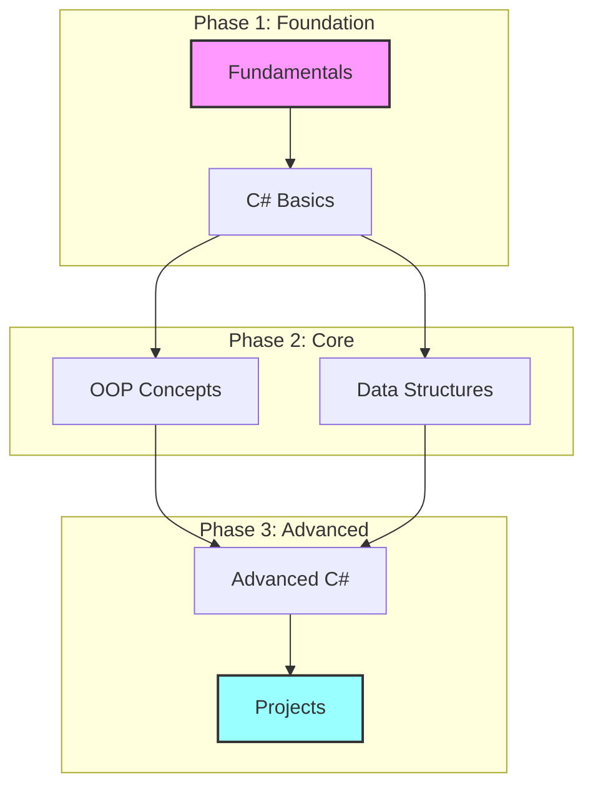

# CSharp04 .NET Development - Final Syllabus

## Course Information
**Course Code:** CS304  
**Duration:** September 2024 - January 2025  
**Format:** Twice Weekly (2 hours per session)  
**Total Hours:** 64 hours  
**Prerequisites:** Basic computer literacy  
**Instructor:** Parviz Rovshan Aliyev  
**Language:** English  

## Course Overview

## Quick Links
[📚 Modules](#modules) | 
[🎯 Objectives](#learning-objectives) | 
[📅 Schedule](#course-schedule) | 
[📝 Assessment](#assessment-methods)

## Learning Objectives
By the end of this course, students will be able to:
1. Master C# programming fundamentals and advanced concepts
2. Develop robust applications using .NET framework
3. Implement object-oriented programming principles
4. Work with databases and data structures
5. Apply industry best practices in software development
6. Build and deploy real-world applications

## Course Structure

### Module 1: Computing and Programming Fundamentals (Weeks 1-2)
- Computer Architecture and Networking Basics
- Development Environment Setup
- Introduction to Programming Concepts
- Version Control with Git

### Module 2: C# Language Fundamentals (Weeks 3-5)
- C# Syntax and Basic Constructs
- Variables, Data Types, and Type System
- Operators and Control Structures
- Memory Management (Stack vs Heap)
- Error Handling and Debugging

### Module 3: Object-Oriented Programming (Weeks 6-8)
- Classes and Objects
- Inheritance and Polymorphism
- Encapsulation and Abstraction
- Interfaces and Abstract Classes
- Properties and Methods

### Module 4: Advanced C# Concepts (Weeks 9-11)
- Collections and Generics
- Delegates and Events
- LINQ and Lambda Expressions
- Asynchronous Programming
- Exception Handling

### Module 5: Data Structures and Algorithms (Weeks 12-13)
- Arrays and Lists
- Stacks and Queues
- Searching and Sorting
- Basic Algorithm Analysis
- Common Programming Patterns

### Module 6: Database and API Integration (Weeks 14-15)
- SQL Fundamentals
- Entity Framework Core
- RESTful APIs
- Data Access Patterns
- API Security Basics

### Module 7: Project Development (Weeks 16-17)
- Project Planning and Architecture
- Implementation and Testing
- Code Review and Optimization
- Deployment Basics
- Final Project Presentation

## Assessment Methods
- **Attendance & Participation:** 20%
- **Assignments & Labs:** 30%
- **Mid-term Project:** 20%
- **Final Project:** 30%

## Course Materials
### Required Software
- Visual Studio 2022 Community Edition
- .NET 6.0+ SDK
- Git
- SQL Server Express
- Visual Studio Code (optional)

### Learning Resources
1. Official Documentation
   - [Microsoft C# Documentation](https://docs.microsoft.com/en-us/dotnet/csharp/)
   - [.NET Documentation](https://docs.microsoft.com/en-us/dotnet/)

2. Online Resources
   - Course-specific materials and slides
   - Code samples and exercises
   - Video tutorials and recordings

## Project Work
### Mid-term Project Options
1. Console-based Management System
2. Data Processing Application
3. Simple Game Development

### Final Project Options
1. Full-stack Web Application
2. Desktop Application with Database
3. RESTful API Service

## Course Policies
### Attendance
- Minimum 80% attendance required
- Active participation in discussions
- Completion of in-class exercises

### Assignment Submission
- All assignments submitted via GitHub
- Code quality and documentation required
- Timely submission expected

### Academic Integrity
- Original work required
- Proper citation of sources
- Collaboration guidelines provided

## Support and Communication
- GitHub Issues for technical questions
- Email for administrative matters
- One-on-one mentoring available
- Code review sessions

## Career Development
### Industry Preparation
- Resume building
- Portfolio development
- Interview preparation
- Coding best practices

### Potential Career Paths
- .NET Developer
- Software Engineer
- Full-stack Developer
- Application Developer

## Weekly Schedule
[Detailed weekly schedule from existing course outline]

## Additional Resources
### Recommended Reading
1. "C# in Depth" by Jon Skeet
2. "Clean Code" by Robert C. Martin
3. "Design Patterns" by Gang of Four

### Online Platforms
- Pluralsight
- LinkedIn Learning
- Microsoft Learn

### Community Resources
- Stack Overflow
- GitHub Discussions
- .NET Community Forums

---

## Course Updates and Revisions
This syllabus is subject to change based on class progress and industry developments. Students will be notified of any updates.

[Back to Top](#csharp04-net-development---final-syllabus) 